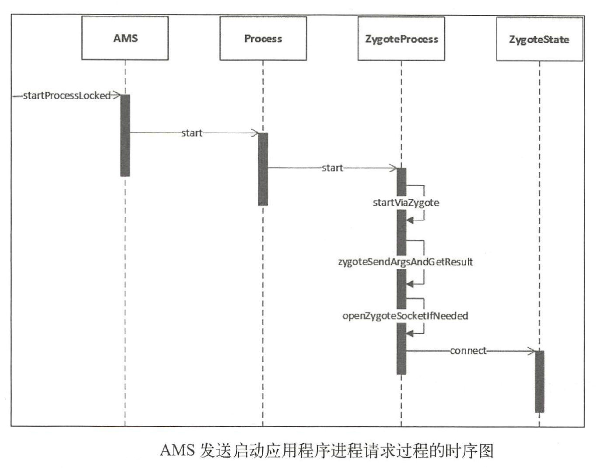
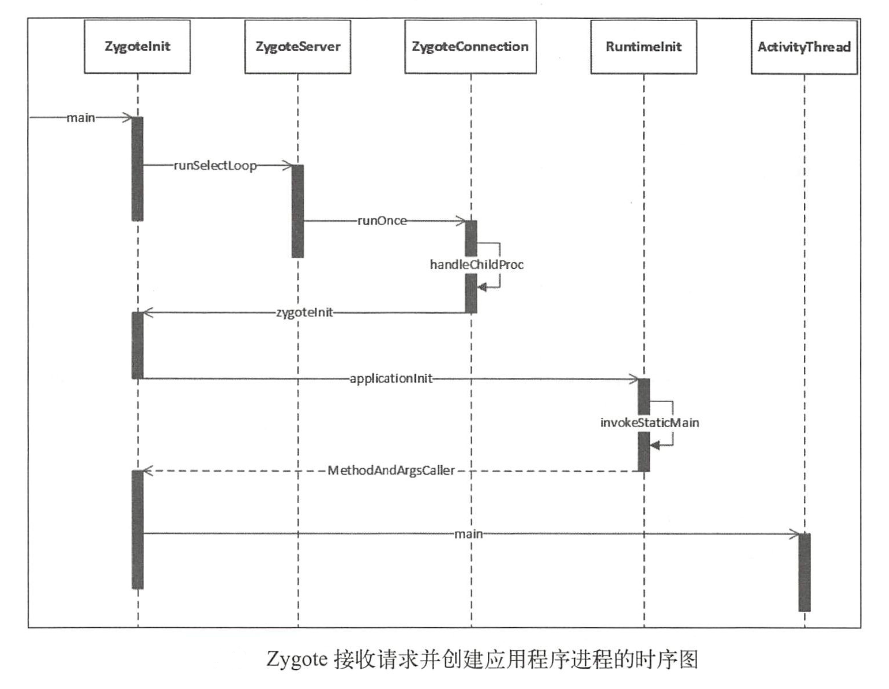

# 应用程序进程启动过程

要想启动一个应用程序，首先要保证这个应用程序所需要的应用程序进程已经启动。AMS在启动应用程序时会检查这个应用程序需要的应用程序进程是否存在，不存在就会请求Zygote进程启动需要的应用程序进程。

# 应用程序进程启动过程

## AMS发送启动应用程序进程请求



## Zygote接受请求并创建应用程序进程



# Binder线程池启动过程

```java
    /**
     * The main function called when started through the zygote process. This
     * could be unified with main(), if the native code in nativeFinishInit()
     * were rationalized with Zygote startup.<p>
     *
     * Current recognized args:
     * <ul>
     *   <li> <code> [--] &lt;start class name&gt;  &lt;args&gt;
     * </ul>
     *
     * @param targetSdkVersion target SDK version
     * @param argv arg strings
     */
    public static final void zygoteInit(int targetSdkVersion, String[] argv,
            ClassLoader classLoader) throws Zygote.MethodAndArgsCaller {
        if (RuntimeInit.DEBUG) {
            Slog.d(RuntimeInit.TAG, "RuntimeInit: Starting application from zygote");
        }

        Trace.traceBegin(Trace.TRACE_TAG_ACTIVITY_MANAGER, "ZygoteInit");
        RuntimeInit.redirectLogStreams();

        RuntimeInit.commonInit();
        ZygoteInit.nativeZygoteInit();//创建binder线程池
        RuntimeInit.applicationInit(targetSdkVersion, argv, classLoader);
    }
```

在进程创建完毕之后，也就是ZygoteConnection的runOnce方法中，进程被创建后会接着创建binder线程池即zygoteInit方法中执行`ZygoteInit.nativeZygoteInit();`。该方法会通过jni的方式创建binder线程池。

# 消息循环创建

当进程创建好了之后会回到ZygoteInit的main方法的异常中：

```java
public static void main(String argv[]) {
    ...
    try {
        ...
    } catch (Zygote.MethodAndArgsCaller caller) {
        caller.run();
    } catch (Throwable ex) {
        Log.e(TAG, "System zygote died with exception", ex);
        zygoteServer.closeServerSocket();
        throw ex;
    }
}
```

这个`caller.run()`会执行ActivityThread的main方法中

```java
public static void main(String[] args) {
    ...
    //创建主线程Looper
    Looper.prepareMainLooper();
    ActivityThread thread = new ActivityThread();
    thread.attach(false);
    if (sMainThreadHandler == null) {
        //创建主线程H类
        sMainThreadHandler = thread.getHandler();
    }
    if (false) {
        Looper.myLooper().setMessageLogging(new LogPrinter(Log.DEBUG, "ActivityThread"));
    }
    // End of event ActivityThreadMain.
    Trace.traceEnd(Trace.TRACE_TAG_ACTIVITY_MANAGER);
    //Looper开始工作
    Looper.loop();

    throw new RuntimeException("Main thread loop unexpectedly exited");
}
```

ActivityThread类用于管理当前应用程序进程的主线程。