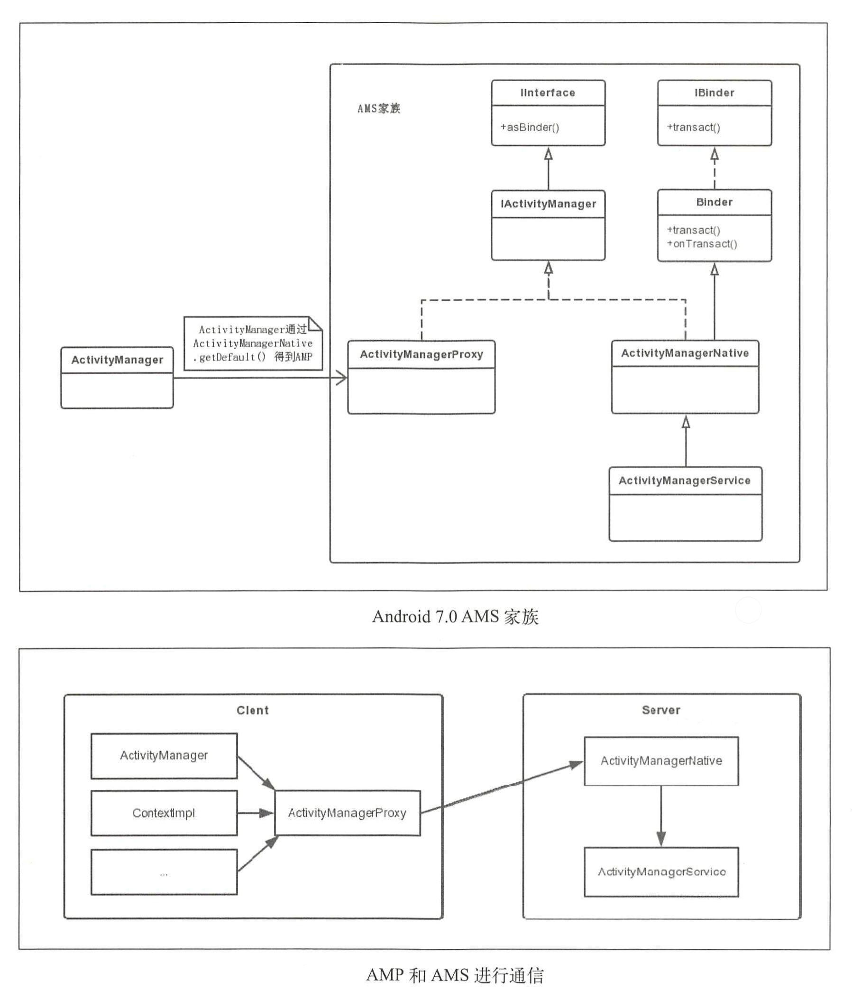
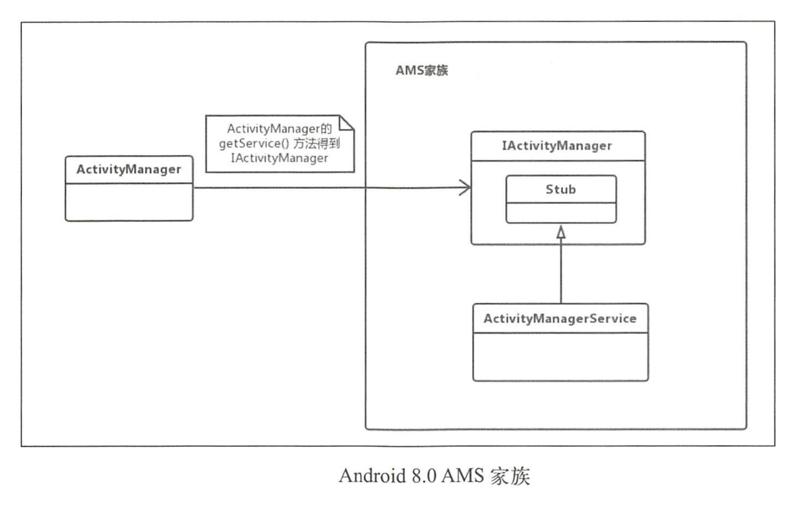
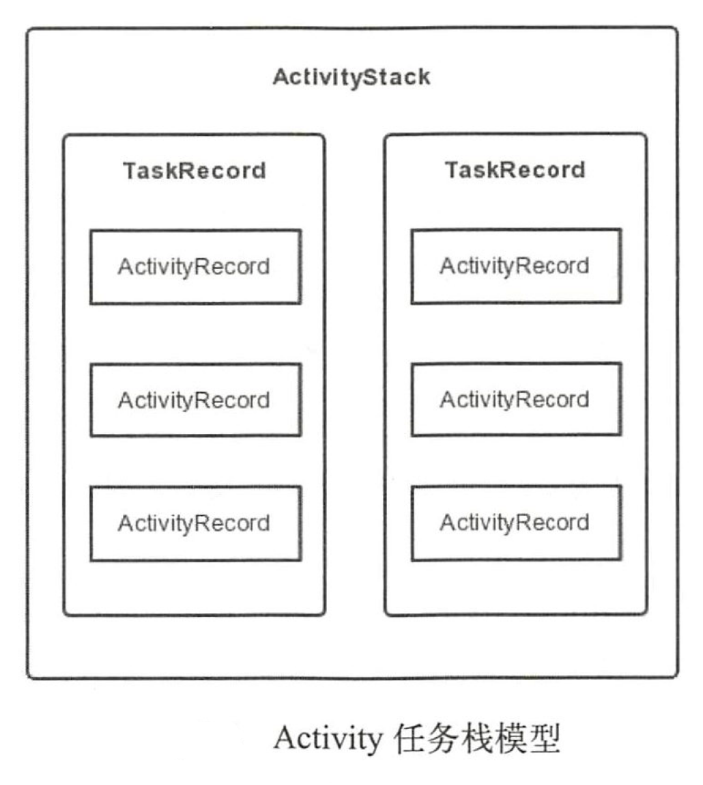

# 理解ActivityManagerService

# AMS家族

## 7.0 AMS家族

Activity启动会调用Instrumentation的`execStartActivity`方法：

```java
public ActivityResult execStartActivity(...){
    ...
    try{
        intent.migrateExtraStreamToClipData();
        intent.prepareToLeaveProcess(who);
        //ActivityManagerNative.getDefault()返回IActivityManager的代理ActivityManager实例
        int result = ActivityManagerNative.getDefault().startActvity(...);
        checkStartActivityResult(result,intent);
    }catch(RemoteException e){
        throw new RuntimeException("Failure form system",e);
    }
    return null;
}
```

AMS相关类的继承关系和调用如下：



## 8.0 AMS家族

同样从Instrumentation的`execStartActivity`方法开始：

```java
public ActivityResult execStartActivity(
    Context who, IBinder contextThread, IBinder token, String target,
    Intent intent, int requestCode, Bundle options) {
    ...
    try {
        intent.migrateExtraStreamToClipData();
        intent.prepareToLeaveProcess(who);
        int result = ActivityManager.getService()
            .startActivity(whoThread, who.getBasePackageName(), intent,
                    intent.resolveTypeIfNeeded(who.getContentResolver()),
                    token, target, requestCode, 0, null, options);
        checkStartActivityResult(result, intent);
    } catch (RemoteException e) {
        throw new RuntimeException("Failure from system", e);
    }
    return null;
}
```



# AMS与应用程序进程

> Zygote的Java框架层会创建一个Server端的socket，这个socket用来等待AMS请求Zygote来创建新的应用程序进程。要启动一个应用程序，首先包保证这个应用程序所需要的应用程序进程已经存在。

AMS与应用程序进程的关系主要有：

- 启动应用程序时AMS会检查这个应用程序所需要的应用程序进程是否存在。
- 如果应用程序进程不用存在，AMS就会请求Zygote进程创建需要的应用程序进程。

# AMS重要的数据结构

**ActvityRecord**、**TaskRecord**、**ActvityStack**

**注意**：ActvityStack管理所有Activity任务栈，其本身是由ActivityStackSupervisor管理，而ActivityStackSupervisor在AMS的构造方法中被创建。

# Activity任务栈

## Activity任务栈模型



**注意**：

- ActivityStack用来管理TaskRecord，包含一个或多个TaskRecord。
- TaskRecord用来表示Avtivity任务栈。
- ActivityRecord纪录了一个Activity的所有信息。
- 一个TaskRecord包含一个或多个ActivityRecord。
- 