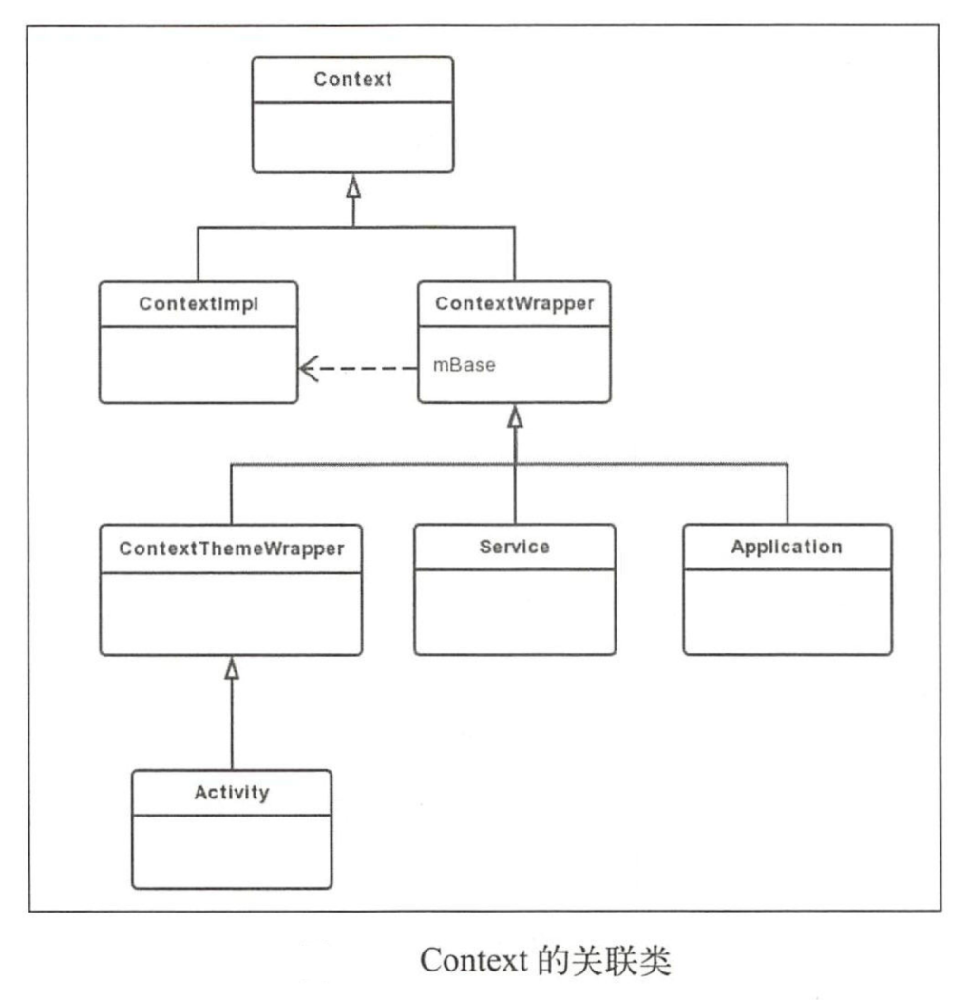
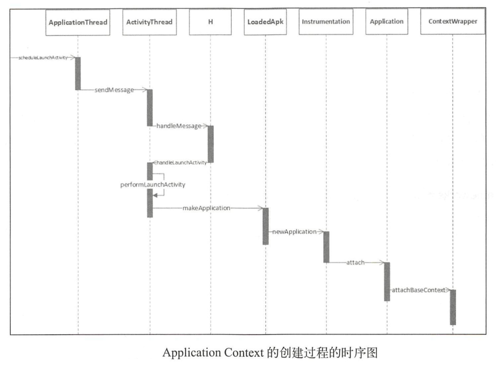
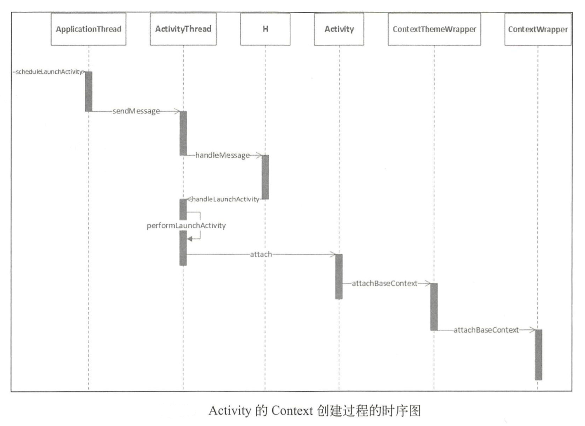

# 理解上下文

# Context的关联类

## 使用场景

- 使用Context调用方法，比如启动Activity、访问资源、调用系统服务等
- 调用方法时传入Context，比如弹出Toast、创建Dialog等

Activity、Service和Application都间接的继承自Context。



# Application Context的创建过程



# Activity的Context创建过程



代码会进入performLaunchActivity方法中：

```java
private Activity performLaunchActivity(ActivityClientRecord r, Intent customIntent) {
    ...
    //创建Activity的Context
    ContextImpl appContext = createBaseContextForActivity(r);
    Activity activity = null;
    try {
        java.lang.ClassLoader cl = appContext.getClassLoader();
        //创建activity实例
        activity = mInstrumentation.newActivity(cl, component.getClassName(), r.intent);
        StrictMode.incrementExpectedActivityCount(activity.getClass());
        r.intent.setExtrasClassLoader(cl);
        r.intent.prepareToEnterProcess();
        if (r.state != null) {
            r.state.setClassLoader(cl);
        }
    } catch (Exception e) {
        ...
    }
    try {
        ...
        if (activity != null) {
            ...
            //mOuterContext，使得ContextImpl可以访问Activity的变量和方法
            appContext.setOuterContext(activity);
            //
            activity.attach(appContext, this, getInstrumentation(), r.token,
                    r.ident, app, r.intent, r.activityInfo, title, r.parent,
                    r.embeddedID, r.lastNonConfigurationInstances, config,
                    r.referrer, r.voiceInteractor, window, r.configCallback);
            ...
            if (r.isPersistable()) {
                //这里会调用Activity的onCreate方法
                mInstrumentation.callActivityOnCreate(activity, r.state, r.persistentState);
            } else {
                mInstrumentation.callActivityOnCreate(activity, r.state);
            }
            ...
        }
        r.paused = true;
        mActivities.put(r.token, r);
    } catch (SuperNotCalledException e) {
        throw e;
    } catch (Exception e) {
        ...
    }
    return activity;
}
```

# Service的Context创建过程

Service的Context的创建过程根Activity类似，过程就不详解了，其主要调用如下：

```java
//ActivityThread.java
public final void scheduleCreateService(...){
    ...
    sendMessage(H.CREATE_SERVICE,s);
}
```

内部类H (Handler)处理消息，调用Activity的handleCreateService方法：

```java
private void handleCreateService(CreateServiceData data){
    ...
    try {
        if (localLOGV) Slog.v(TAG, "Creating service " + data.info.name);
        //创建service的Context
        ContextImpl context = ContextImpl.createAppContext(this, packageInfo);
        context.setOuterContext(service);
        Application app = packageInfo.makeApplication(false, mInstrumentation);
        
        service.attach(context, this, data.info.name, data.token, app, ActivityManager.getService());
        service.onCreate();
        mServices.put(data.token, service);
        try {
            ActivityManager.getService().serviceDoneExecuting(data.token, SERVICE_DONE_EXECUTING_ANON, 0, 0);
        } catch (RemoteException e) {
            throw e.rethrowFromSystemServer();
        }
    } catch (Exception e) {
        ...
    }
}
```


