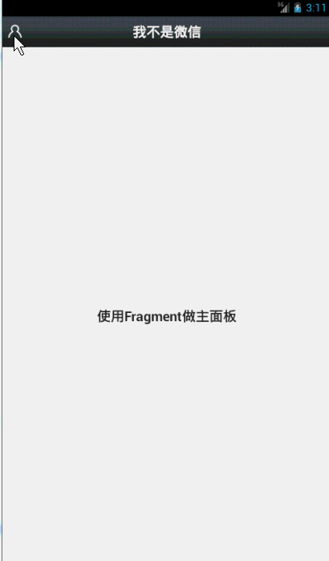
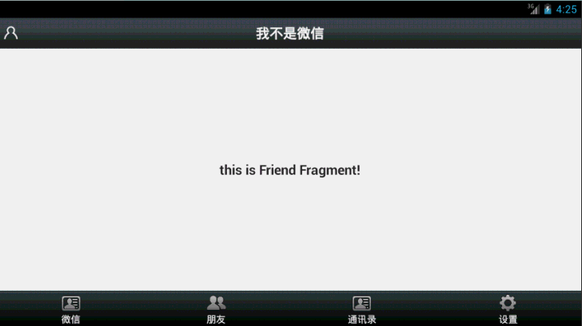

# Android Fragment真正的完全解析（上）

自从Fragment出现，曾经有段时间，感觉大家谈什么都能跟Fragment谈上关系，做什么都要问下Fragment能实现不~~~哈哈，是不是有点过~~~

本篇博客力求为大家说明Fragment如何产生，什么是Fragment，Fragment生命周期，如何静态和动态的使用Fragment，Fragment回退栈，Fragment事务；以及Fragment的一些特殊用途，例如：没有布局的Fragment有何用处？Fragment如何与Activity交互？Fragment如何创建对话框？Fragment如何与ActionBar集成等等。

## 1、Fragment的产生与介绍

Android运行在各种各样的设备中，有小屏幕的手机，超大屏的平板甚至电视。针对屏幕尺寸的差距，很多情况下，都是先针对手机开发一套App，然后拷贝一份，修改布局以适应平板神马超级大屏的。难道无法做到一个App可以同时适应手机和平板么，当然了，必须有啊。Fragment的出现就是为了解决这样的问题。你可以把Fragment当成Activity的一个界面的一个组成部分，甚至Activity的界面可以完全由不同的Fragment组成，更帅气的是Fragment拥有自己的生命周期和接收、处理用户的事件，这样就不必在Activity写一堆控件的事件处理的代码了。更为重要的是，你可以动态的添加、替换和移除某个Fragment。

## 2、Fragment的生命周期

Fragment必须是依存与Activity而存在的，因此Activity的生命周期会直接影响到Fragment的生命周期。官网这张图很好的说明了两者生命周期的关系：


可以看到Fragment比Activity多了几个额外的生命周期回调方法：
**onAttach(Activity)**
当Fragment与Activity发生关联时调用。
**onCreateView(LayoutInflater, ViewGroup,Bundle)**
创建该Fragment的视图
**onActivityCreated(Bundle)**
当Activity的onCreate方法返回时调用
**onDestoryView()**
与onCreateView想对应，当该Fragment的视图被移除时调用
**onDetach()**
与onAttach相对应，当Fragment与Activity关联被取消时调用
注意：除了onCreateView，其他的所有方法如果你重写了，必须调用父类对于该方法的实现，

## 3、静态的使用Fragment

嘿嘿，终于到使用的时刻了~~

这是使用Fragment最简单的一种方式，把Fragment当成普通的控件，直接写在Activity的布局文件中。步骤：

1、继承Fragment，重写onCreateView决定Fragemnt的布局

2、在Activity中声明此Fragment，就当和普通的View一样

下面展示一个例子（我使用2个Fragment作为Activity的布局，一个Fragment用于标题布局，一个Fragment用于内容布局）：

TitleFragment的布局文件:

```xml
<?xml version="1.0" encoding="utf-8"?>
<RelativeLayout xmlns:android="http://schemas.android.com/apk/res/android"
    android:layout_width="match_parent"
    android:layout_height="45dp"
    android:background="@drawable/title_bar" >
    <ImageButton
        android:id="@+id/id_title_left_btn"
        android:layout_width="wrap_content"
        android:layout_height="wrap_content"
        android:layout_centerVertical="true"
        android:layout_marginLeft="3dp"
        android:background="@drawable/showleft_selector" />

    <TextView
        android:layout_width="fill_parent"
        android:layout_height="fill_parent"
        android:gravity="center"
        android:text="我不是微信"
        android:textColor="#fff"
        android:textSize="20sp"
        android:textStyle="bold" />
</RelativeLayout>
```

TitleFragment

```java
package com.zhy.zhy_fragments;

import android.app.Fragment;
import android.os.Bundle;
import android.view.LayoutInflater;
import android.view.View;
import android.view.View.OnClickListener;
import android.view.ViewGroup;
import android.widget.ImageButton;
import android.widget.Toast;

public class TitleFragment extends Fragment
{
    private ImageButton mLeftMenu;

    @Override
    public View onCreateView(LayoutInflater inflater, ViewGroup container,
            Bundle savedInstanceState)
    {
        View view = inflater.inflate(R.layout.fragment_title, container, false);
        mLeftMenu = (ImageButton) view.findViewById(R.id.id_title_left_btn);
        mLeftMenu.setOnClickListener(new OnClickListener()
        {
            @Override
            public void onClick(View v)
            {
                Toast.makeText(getActivity(),
                        "i am an ImageButton in TitleFragment ! ",
                        Toast.LENGTH_SHORT).show();
            }
        });
        return view;
    }
}
```
同理还有ContentFragment的其布局文件：

```xml
<?xml version="1.0" encoding="utf-8"?>
<LinearLayout xmlns:android="http://schemas.android.com/apk/res/android"
    android:layout_width="match_parent"
    android:layout_height="match_parent"
    android:orientation="vertical" >
    <TextView
        android:layout_width="fill_parent"
        android:layout_height="fill_parent"
        android:gravity="center"
        android:text="使用Fragment做主面板"
        android:textSize="20sp"
        android:textStyle="bold" />
</LinearLayout>
```


```java
package com.zhy.zhy_fragments;

import android.app.Fragment;
import android.os.Bundle;
import android.view.LayoutInflater;
import android.view.View;
import android.view.ViewGroup;

public class ContentFragment extends Fragment
{
    @Override
    public View onCreateView(LayoutInflater inflater, ViewGroup container,
            Bundle savedInstanceState)
    {
        return inflater.inflate(R.layout.fragment_content, container, false);
    }
}
```

MainActivity

```JAVA
package com.zhy.zhy_fragments;

import android.app.Activity;
import android.os.Bundle;
import android.view.Window;

public class MainActivity extends Activity
{
    @Override
    protected void onCreate(Bundle savedInstanceState)
    {
        super.onCreate(savedInstanceState);
        requestWindowFeature(Window.FEATURE_NO_TITLE);
        setContentView(R.layout.activity_main);
    }
}
```

Activity的布局文件：

```XML
<RelativeLayout xmlns:android="http://schemas.android.com/apk/res/android"
    xmlns:tools="http://schemas.android.com/tools"
    android:layout_width="match_parent"
    android:layout_height="match_parent" >
    <fragment
        android:id="@+id/id_fragment_title"
        android:name="com.zhy.zhy_fragments.TitleFragment"
        android:layout_width="fill_parent"
        android:layout_height="45dp" />

    <fragment
        android:layout_below="@id/id_fragment_title"
        android:id="@+id/id_fragment_content"
        android:name="com.zhy.zhy_fragments.ContentFragment"
        android:layout_width="fill_parent"
    	android:layout_height="fill_parent" />	
</RelativeLayout>
```


是不是把Fragment当成普通的View一样声明在Activity的布局文件中，然后所有控件的事件处理等代码都由各自的Fragment去处理，瞬间觉得Activity好干净有木有~~代码的可读性、复用性以及可维护性是不是瞬间提升了~~~下面看下效果图：



## 4、动态的使用Fragment

上面已经演示了，最简单的使用Fragment的方式~下面介绍如何动态的添加、更新、以及删除Fragment

为了动态使用Fragment，我们修改一下Actvity的布局文件，中间使用一个FrameLayout，下面添加四个按钮~~~嘿嘿~~不是微信的按钮- -！

```xml
<RelativeLayout xmlns:android="http://schemas.android.com/apk/res/android"
    xmlns:tools="http://schemas.android.com/tools"
    android:layout_width="match_parent"
    android:layout_height="match_parent" >
    <fragment
        android:id="@+id/id_fragment_title"
        android:name="com.zhy.zhy_fragments.TitleFragment"
        android:layout_width="fill_parent"
        android:layout_height="45dp" />

    <include
        android:id="@+id/id_ly_bottombar"
        android:layout_width="fill_parent"
        android:layout_height="55dp"
        android:layout_alignParentBottom="true"
        layout="@layout/bottombar" />

    <FrameLayout
        android:id="@+id/id_content"
        android:layout_width="fill_parent"
        android:layout_height="fill_parent"
        android:layout_above="@id/id_ly_bottombar"
        android:layout_below="@id/id_fragment_title" />
</RelativeLayout>
```

底部四个按钮的布局就不贴了，到时看效果图就明白了~~
下面主Activity

```java
package com.zhy.zhy_fragments;

import android.app.Activity;
import android.app.FragmentManager;
import android.app.FragmentTransaction;
import android.os.Bundle;
import android.view.View;
import android.view.View.OnClickListener;
import android.view.Window;
import android.widget.LinearLayout;

public class MainActivity extends Activity implements OnClickListener
{
	private LinearLayout mTabWeixin;
	private LinearLayout mTabFriend;
    private ContentFragment mWeixin;
    private FriendFragment mFriend;

    @Override
    protected void onCreate(Bundle savedInstanceState)
    {
        super.onCreate(savedInstanceState);
        requestWindowFeature(Window.FEATURE_NO_TITLE);
        setContentView(R.layout.activity_main);

        // 初始化控件和声明事件
        mTabWeixin = (LinearLayout) findViewById(R.id.tab_bottom_weixin);
        mTabFriend = (LinearLayout) findViewById(R.id.tab_bottom_friend);
        mTabWeixin.setOnClickListener(this);
        mTabFriend.setOnClickListener(this);

        // 设置默认的Fragment
        setDefaultFragment();
    }

    private void setDefaultFragment()
    {
        FragmentManager fm = getFragmentManager();
        FragmentTransaction transaction = fm.beginTransaction();
        mWeixin = new ContentFragment();
        transaction.replace(R.id.id_content, mWeixin);
        transaction.commit();
    }

    @Override
    public void onClick(View v)
    {
        FragmentManager fm = getFragmentManager();
        // 开启Fragment事务
        FragmentTransaction transaction = fm.beginTransaction();

        switch (v.getId())
        {
        case R.id.tab_bottom_weixin:
            if (mWeixin == null)
            {
                mWeixin = new ContentFragment();
            }
            // 使用当前Fragment的布局替代id_content的控件
            transaction.replace(R.id.id_content, mWeixin);
            break;
        case R.id.tab_bottom_friend:
            if (mFriend == null)
            {
                mFriend = new FriendFragment();
            }
            transaction.replace(R.id.id_content, mFriend);
            break;
        }
        // transaction.addToBackStack();
        // 事务提交
        transaction.commit();
    }
}
```

可以看到我们使用FragmentManager对Fragment进行了动态的加载，这里使用的是replace方法~~下一节我会详细介绍FragmentManager的常用API。

> 注：如果使用Android3.0以下的版本，需要引入v4的包，然后Activity继承FragmentActivity，然后通过getSupportFragmentManager获得FragmentManager。不过还是建议版Menifest文件的uses-sdk的minSdkVersion和targetSdkVersion都改为11以上，这样就不必引入v4包了。

代码中间还有两个Fragment的子类，ContentFragment上面已经见过，FriendFragment其实类似：

```java
package com.zhy.zhy_fragments;

import android.app.Fragment;
import android.os.Bundle;
import android.view.LayoutInflater;
import android.view.View;
import android.view.ViewGroup;

public class FriendFragment extends Fragment
{
    @Override
    public View onCreateView(LayoutInflater inflater, ViewGroup container,
            Bundle savedInstanceState)
    {
        return inflater.inflate(R.layout.fragment_friend, container, false);
    }
}
```

效果图：




可以看到很好的实现了效果，其实这个效果以前的博客中也出现过，在博客：Android项目Tab类型主界面大总结 Fragment+TabPageIndicator+ViewPager，有兴趣可以看看。ps:为了代码的简洁，就不添加按钮的点击变化什么的了，主要讲解功能了~~~

## 5、Fragment家族常用的API

Fragment常用的三个类：

```java
android.app.Fragment //主要用于定义Fragment
android.app.FragmentManager //主要用于在Activity中操作Fragment
android.app.FragmentTransaction //保证一些列Fragment操作的原子性，熟悉事务这个词，一定能明白~
```

a、获取FragmentManage的方式：

```java
getFragmentManager() // v4中，getSupportFragmentManager
```

b、主要的操作都是FragmentTransaction的方法

```java
FragmentTransaction transaction = fm.benginTransatcion(); //开启一个事务
transaction.add() //往Activity中添加一个Fragment
transaction.remove() //从Activity中移除一个Fragment，如果被移除的Fragment没有添加到回退栈（回退栈后面会详细说），这个Fragment实例将会被销毁。
transaction.replace() //使用另一个Fragment替换当前的，实际上就是remove()然后add()的合体~
transaction.hide() //隐藏当前的Fragment，仅仅是设为不可见，并不会销毁
transaction.show() //显示之前隐藏的Fragment
detach() //会将view从UI中移除,和remove()不同,此时fragment的状态依然由FragmentManager维护。
attach() //重建view视图，附加到UI上并显示。
transatcion.commit()//提交一个事务
```

> 注意：常用Fragment的哥们，可能会经常遇到这样Activity状态不一致：State loss这样的错误。主要是因为：commit方法一定要在Activity.onSaveInstance()之前调用。

上述，基本是操作Fragment的所有的方式了，在一个事务开启到提交可以进行多个的添加、移除、替换等操作。

值得注意的是：如果你喜欢使用Fragment，一定要清楚这些方法，哪个会销毁视图，哪个会销毁实例，哪个仅仅只是隐藏，这样才能更好的使用它们。

- a、比如：我在FragmentA中的EditText填了一些数据，当切换到FragmentB时，如果希望会到A还能看到数据，则适合你的就是hide和show；也就是说，希望保留用户操作的面板，你可以使用hide和show，当然了不要使劲在那new实例，进行下非null判断。

- b、再比如：我不希望保留用户操作，你可以使用remove()，然后add()；或者使用replace()这个和remove,add是相同的效果。

- c、remove和detach有一点细微的区别，在不考虑回退栈的情况下，remove会销毁整个Fragment实例，而detach则只是销毁其视图结构，实例并不会被销毁。那么二者怎么取舍使用呢？如果你的当前Activity一直存在，那么在不希望保留用户操作的时候，你可以优先使用detach。

上述已经介绍完成了Fragment常用的一些方法，相信看完，大家一定清楚了Fragment的产生理由，以及如何使用Fragment，再根据API的讲解，也能明白，曾经为何觉得Fragment会出现一些列乱七八槽的问题，终究是因为没有弄清楚其生命周期。

由于篇幅原因，剩下的内容留到下一篇了。在下一篇，会介绍：

1、如何管理Fragment回退栈

2、Fragment如何与Activity交互

3、Fragment与Activity交互的最佳实践

4、没有视图的Fragment的用处

5、使用Fragment创建对话框

6、如何与ActionBar，MenuItem集成等~~


下一篇：Android Fragment 真正的完全解析（下）


好了，有任何问题请留言~~


会将view从UI中移除,和remove()不同,此时fragment的状态依然由FragmentManager维护。
————————————————
版权声明：本文为CSDN博主「鸿洋_」的原创文章，遵循 CC 4.0 BY-SA 版权协议，转载请附上原文出处链接及本声明。
原文链接：https://blog.csdn.net/lmj623565791/java/article/details/37970961