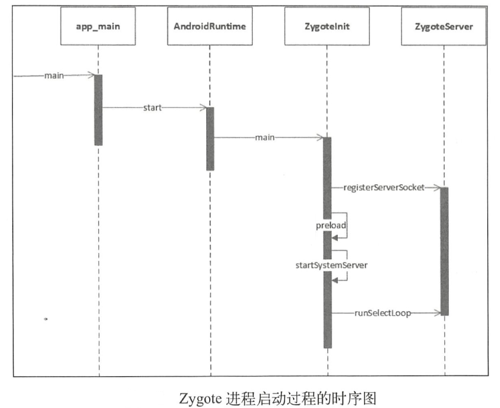
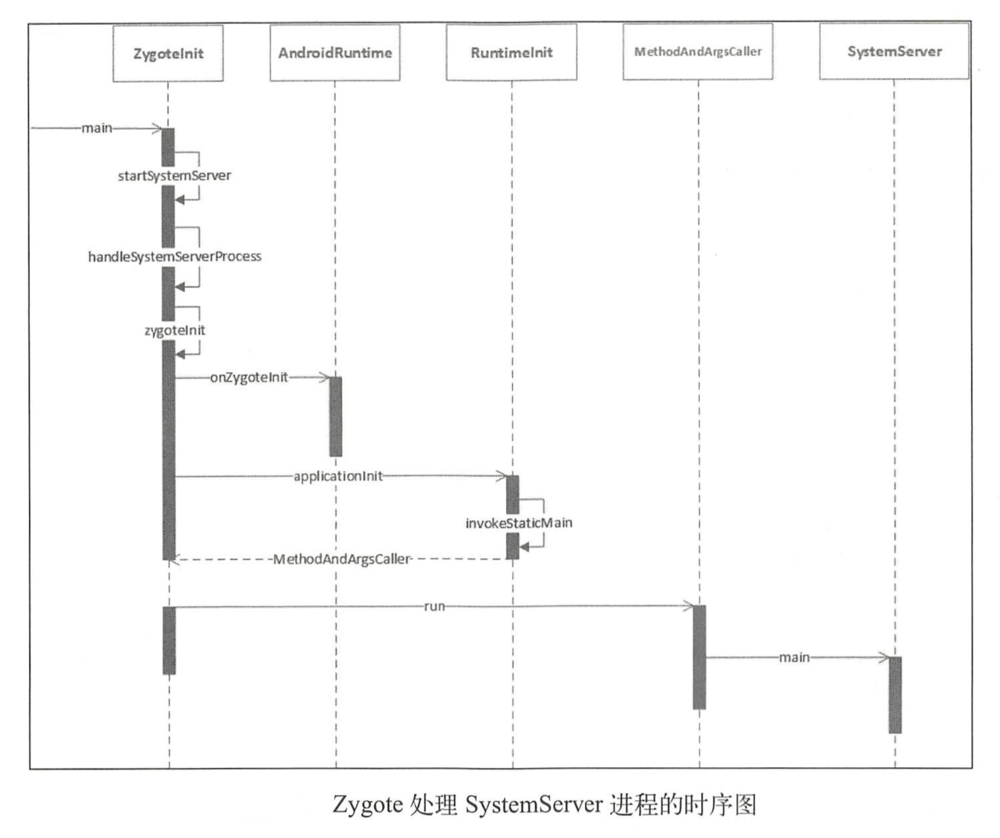
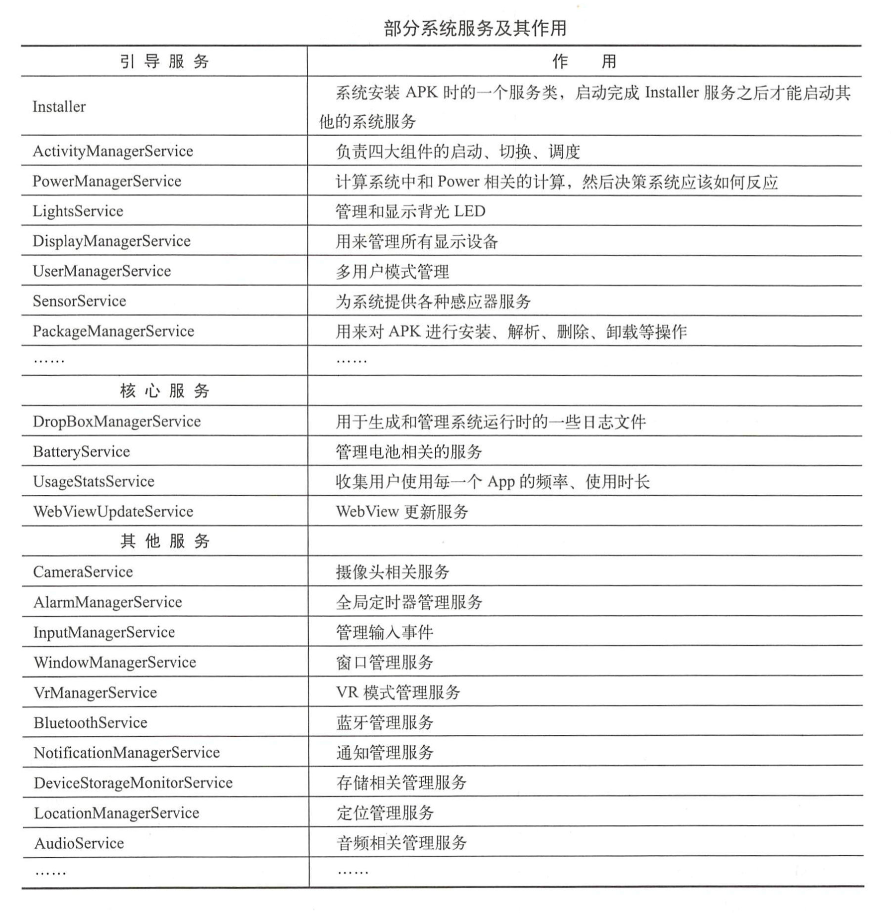
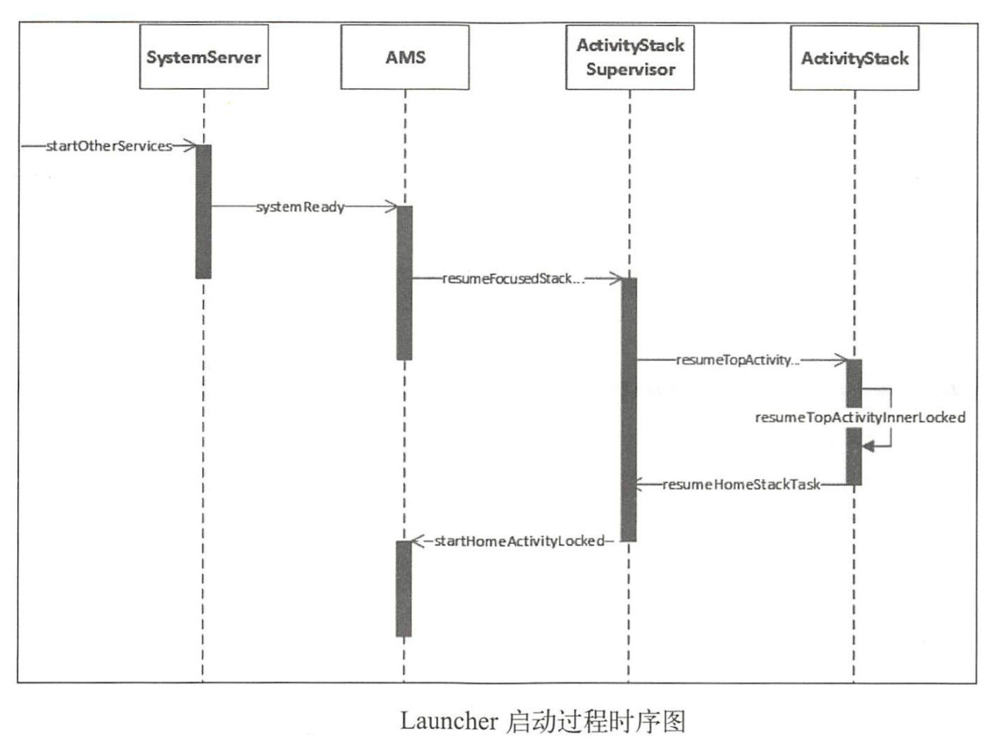
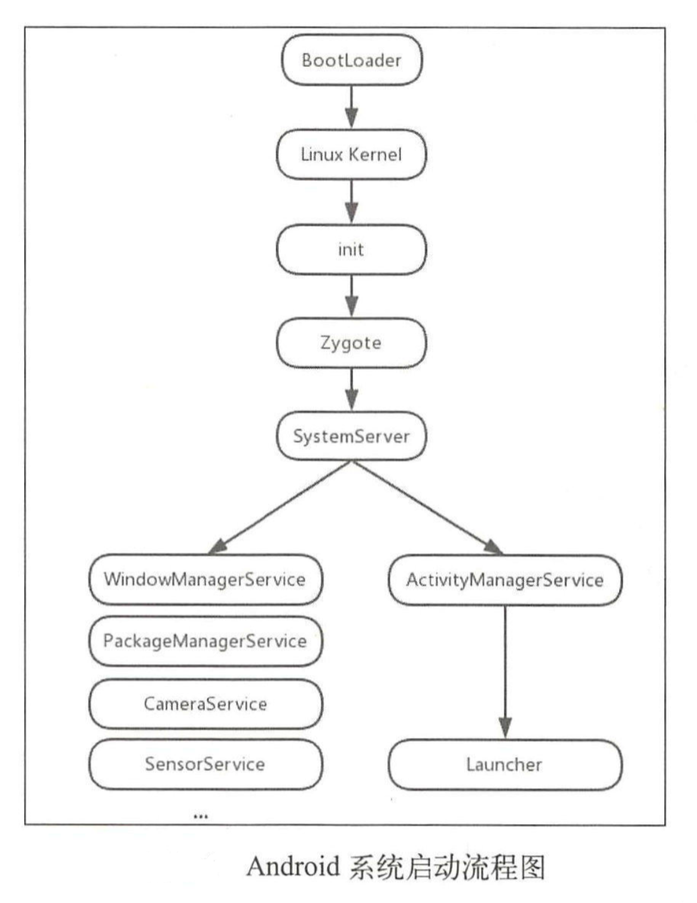

# Android系统启动流程

# init进程启动过程

> `init.cpp -> main`

## 启动电源以及系统启动

当电源按下时引导芯片代码从预定义的地方（固化在ROM）开始执行。加载引导程序BootLoader到RAM中，然后执行。

## 引导程序BootLoader

引导程序BootLoader是在Android操作系统开始运行前的一个小程序，它的主要作用是把操作系统OS拉起来并运行。

## Linux内核启动

当内核启动时，设置缓存、被保护存储器、计划列表、加载驱动。在内核完成系统设置后，它首先在系统文件中寻找init.rc文件，并启动init进程。

## init进程启动

init进程做的工作比较多，主要用来初始化和启动属性服务，也用来启动Zygote进程。

## 总结

init进程启动做了很多的工作，总结起来大概如下：

- 创建和挂载启动所需的文件目录
- 初始化和启动属性服务
- 解析init.rc配置文件并启动Zygote进程

# Zygote启动

> 在Android系统中，DVM（Dalvik虚拟机）和ART、应用程序进程以及运行系统的关键服务的SystemServer进程都是由Zygote进程来创建的，我也将它称为孵化器。它通过fork的形式来创建应用程序进程和SystemServer进程，由于Zygote进程在启动时会创建DVM或者ART，因此通过fork的方式创建进程可以在内部获得DVM或ART实例副本。

### 总结

zygote进程启动共做了如下工作：

- 创建AppRuntime并调用其start方法，启动Zygote进程。
- 创建Java虚拟机并为Java虚拟机注册JNI方法。
- 通过JNI调用ZygoteInit的main函数进入Zygote的Java框架层。
- 通过registerZygoteSocket方法创建服务器Socket，并通过runSelectLoop方法等待AMS的请求来创建新的应用程序进程。
- 启动SystemServer进程。

# SystemServer处理过程

> SystemServer进程主要用于创建系统服务，我们熟知的AMS、WMS和PMS都是由它来创建的。

## 启动的服务

## 总结

SystemServer进程被创建后，主要工作如下：

- 启动Binder线程池，这样就可以与其他进程进行通讯。
- 创建SystemServiceManager，用于对系统的服务进行创建、启动和生命周期的管理。
- 启动各种系统服务。

# Launcher启动过程

> 系统启动的最后一步是启动一个应用程序用来显示系统中已经安装的应用程序，这个应用程序就是launcher。launcher在启动的过程中会请求PackageManagerService返回系统中已经安装的应用程序的信息，并通过这些信息分装成桌面的图标，这样用户只要点击图标就能启动相应的应用程序了。

启动Launcher的入口为AMS的systemReady方法，它在SystemServer的startOtherService方法中被调用。

# Android系统启动流程图

备注：在init环节中还会启动ServiceManager进程。

*源于《Android进阶解密》之Android系统启动*