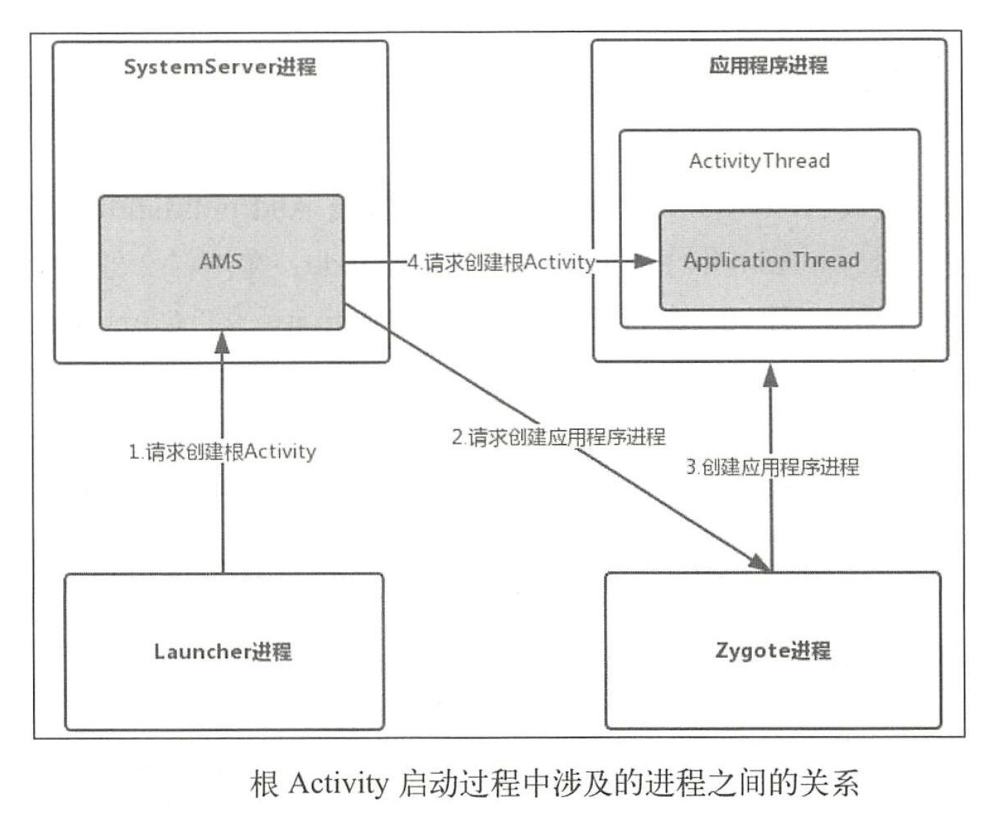

# 四大组件的工作过程

# 根Activity的启动过程

## Launcher请求AMS过程

当我们点击某个应用程序的快捷图标时，就会通过Launcher请求AMS来启动该应用程序。


## AMS到ApplicationThread的调用过程


ActivityStackSupervisor中`startSpecifivActivityLocked(...)`：

```java
void startSpecificActivityLocked(ActivityRecord r,
        boolean andResume, boolean checkConfig) {
    //获取即将启动的Activity的所在的应用程序进程
    ProcessRecord app = mService.getProcessRecordLocked(r.processName,
            r.info.applicationInfo.uid, true);

    r.getStack().setLaunchTime(r);

    if (app != null && app.thread != null) {
        try {
            if ((r.info.flags&ActivityInfo.FLAG_MULTIPROCESS) == 0
                    || !"android".equals(r.info.packageName)) {
                // Don't add this if it is a platform component that is marked
                // to run in multiple processes, because this is actually
                // part of the framework so doesn't make sense to track as a
                // separate apk in the process.
                app.addPackage(r.info.packageName, r.info.applicationInfo.versionCode,
                        mService.mProcessStats);
            }
            realStartActivityLocked(r, app, andResume, checkConfig);
            return;
        } catch (RemoteException e) {
            Slog.w(TAG, "Exception when starting activity "
                    + r.intent.getComponent().flattenToShortString(), e);
        }

        // If a dead object exception was thrown -- fall through to
        // restart the application.
    }
	//Activity所需进程不存在，则创建进程
    mService.startProcessLocked(r.processName, r.info.applicationInfo, true, 0,
            "activity", r.intent.getComponent(), false, false, true);
}
```


## ActivityThread启动Activity


## 根Activity启动过程中涉及的进程

根Activity启动会涉及四个进程：ActivityServiceManager、Zygote、Launcher、应用程序进程，他们之间的关系如下：



首先Launcher进程向AMS请求创建根Activity，AMS会判断根Activity所需的应用程序进程是否存在并启动，如果不存在就会请求Zygote进程创建应用程序进程。应用程序进程启动后，AMS会请求创建应用程序进程并启动根Activity。

对应的时序图如下：


# Service的启动过程

## ContextImpl到AMS的调用过程


经过层层调用，最终回到了AMS中了。

## ActivtiyThread启动Service

接着从AMS的startService开始


在`bringUpServiceLocked(...)`中会判断服务所需进程是否存在：

```java
private String bringUpServiceLocked(ServiceRecord r, int intentFlags, boolean execInFg,
        boolean whileRestarting, boolean permissionsReviewRequired)
        throws TransactionTooLargeException {
    ...
    //获取Service想要运行进程的名称
    final String procName = r.processName;
    String hostingType = "service";
    ProcessRecord app;
    if (!isolated) {
        app = mAm.getProcessRecordLocked(procName, r.appInfo.uid, false);
        if (DEBUG_MU) Slog.v(TAG_MU, "bringUpServiceLocked: appInfo.uid=" + r.appInfo.uid + " app=" + app);
        //如果运行Service的进程存在
        if (app != null && app.thread != null) {
            try {
                app.addPackage(r.appInfo.packageName, r.appInfo.versionCode, mAm.mProcessStats);
                //启动Service
                realStartServiceLocked(r, app, execInFg);
                return null;
            } catch (TransactionTooLargeException e) {
                throw e;
            } catch (RemoteException e) {
                Slog.w(TAG, "Exception when starting service " + r.shortName, e);
            }
        }
    } else {
        app = r.isolatedProc;
        if (WebViewZygote.isMultiprocessEnabled() && r.serviceInfo.packageName.equals(WebViewZygote.getPackageName())) {
            hostingType = "webview_service";
        }
    }
    //如果运行Service的进程不存在
    if (app == null && !permissionsReviewRequired) {
        //创建进程
        if ((app=mAm.startProcessLocked(procName, r.appInfo, true, intentFlags,
                hostingType, r.name, false, isolated, false)) == null) {
            String msg = "Unable to launch app "
                    + r.appInfo.packageName + "/"
                    + r.appInfo.uid + " for service "
                    + r.intent.getIntent() + ": process is bad";
            Slog.w(TAG, msg);
            bringDownServiceLocked(r);
            return msg;
        }
        if (isolated) {
            r.isolatedProc = app;
        }
    }
    ...
    return null;
}
```


# Service的绑定过程

## ContextImpl到AMS的调用过程


最后，转到了AMS中。

## Service的绑定过程

### AMS -> publishService


### AMS->ServiceConnection

## 

# 广播

待续...

# ContentProvider

待续...


# 参考

- [Android进程间通信（IPC）机制Binder简要介绍和学习计划](https://blog.csdn.net/luoshengyang/article/details/6618363)
- [Android系统进程间通信Binder机制在应用程序框架层的Java接口源代码分析](https://blog.csdn.net/luoshengyang/article/details/6642463)
- [Android进阶（三）：Application启动过程(最详细&最简单)](https://www.jianshu.com/p/4a8f44b6eecb)

- [Android进阶（四）：Activity启动过程(最详细&最简单)](https://www.jianshu.com/p/7d0d548ebbb4)
- [Android的Activity启动流程分析](https://blog.csdn.net/u012267215/article/details/91406211)
- [3分钟看懂Activity启动流程](https://www.jianshu.com/p/9ecea420eb52)
- [总结UI原理和高级的UI优化方式](https://juejin.im/post/5dac6aa2518825630e5d17da#heading-20)


