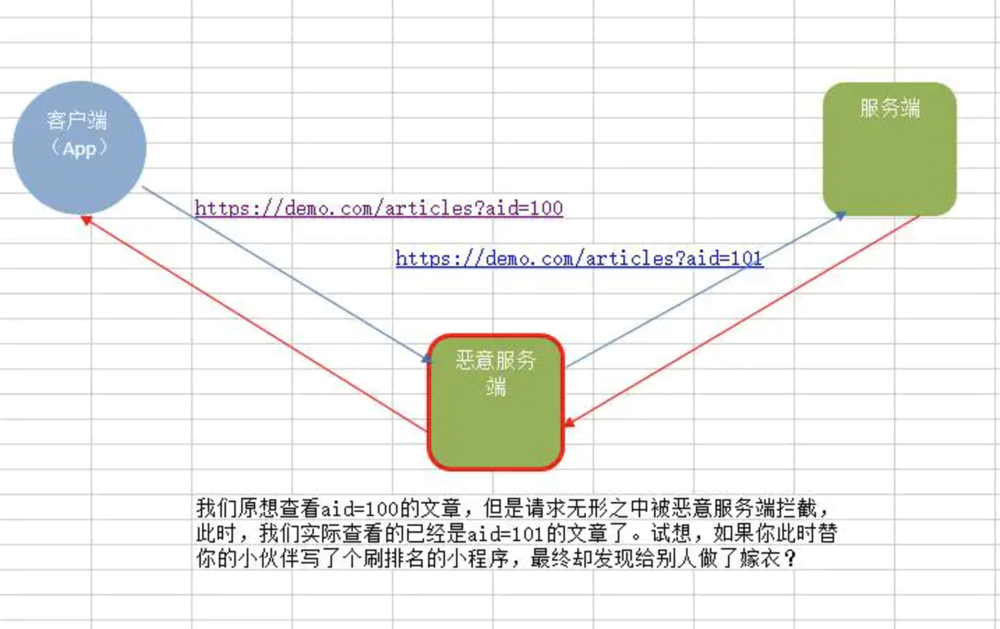
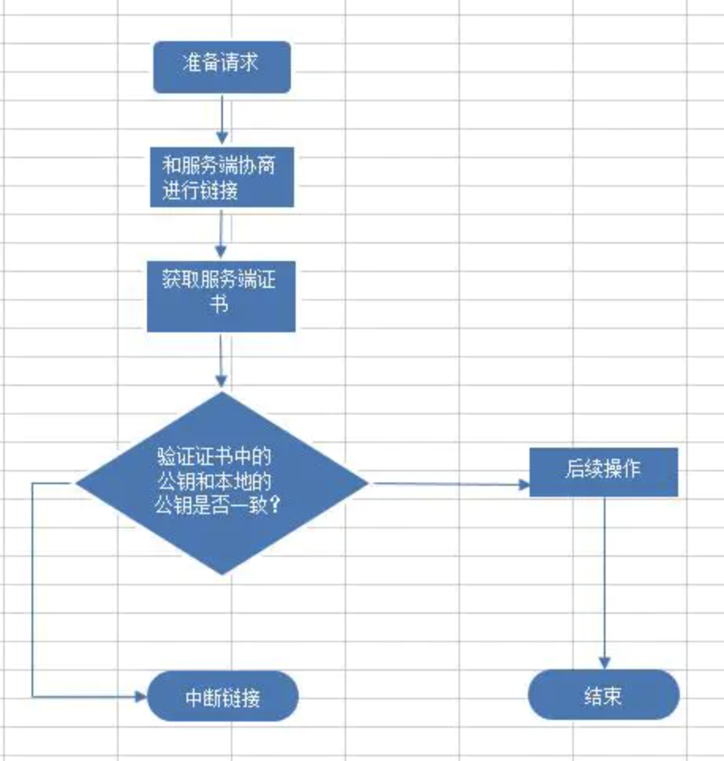
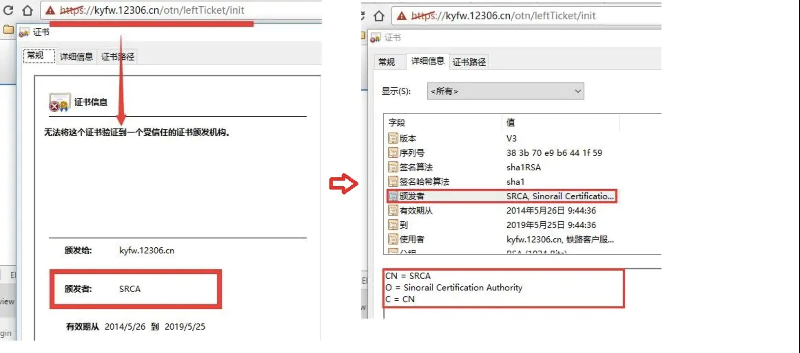

# 学会正确的使用 https，不要留下漏洞！！

原文链接： [blog.csdn.net](http://blog.csdn.net/dd864140130/article/details/52625666)

很多文章对客户端https的使用都是很模糊的，不但如此，有些开发者直接从网上拷贝一些使用https的“漏洞”代码，无形之中让客户端处在一种高风险的情况下。

今天我们就对有关https使用的问题进行深入的探讨，希望能解决以往的困惑。对于https，需要了解其工作原理的可以参考[https是如何工作的？](http://blog.csdn.net/dd864140130/article/details/52598107)，更多关于https的问题我会站在客户端的角度在后面陆陆续续的写出来。

## 证书锁定

## 简介

首先来说说什么是证书锁定。

证书锁定是用来限制哪些证书和证书颁发机构是可信任的。需要我们直接在代码中固定写死使用某个服务器的证书，然后用自定义的信任存储去代替系统系统自带的，再去连接我们的服务器，我们将这种做法称之为证书锁定。换言之，证书锁定就是在代码中验证当前服务器是否持有某张指定的证书，如果不是则强行断开链接。

有同学问证书锁定有什么好处么？最大的好处使用证书锁定提高安全性，降低了成本。为什么这么说呢？如果你想破解该通信，需要首先拿到客户端，然后对其反编译，修改后再重新打包签名，相比原先的做法，这无疑是增加了破解难度。除了之外，由于证书锁定可以使用自签名的证书，那就意味着我们不需要再向android认可的证书颁发机构购买证书了，这样就可以剩下每年1000多块钱的证书费用，能省一点就省一点嘛。

## retrofit中使用证书锁定

现在，我们来看看如何在retrofit中进行证书锁定。

```
OkHttpClient client = new OkHttpClient.Builder()
    .certificatePinner(new CertificatePinner.Builder()
            .add("sbbic.com", "sha1/C8xoaOSEzPC6BgGmxAt/EAcsajw=")
            .add("closedevice.com", "sha1/T5x9IXmcrQ7YuQxXnxoCmeeQ84c=")
            .build())
```

通过上面的代码不难看出，retrofit中的证书锁定同样是借助OkHttpClient实现的：通过为OkHttpClient添加CertificatePinner即可。CertificatePinner对象以构建器的方式创建，可以通过其add()方法来锁定多个证书。

## 证书锁定的原理

现在我们深入下证书锁定的原理。我们知道，无论http还是https，都是服务端被动，客户端主动。那么问题来了，客户端第一次发出请求之后，无法确定服务端是不是合法的。那么很可能就会出现以下情景：

正常情况下是这样，我们想要根据文章aid查看某篇文章内容，其流程如下：


此时，如果黑客恶意拦截这个通信过程，会是怎么样？


此时恶意服务端完全可以发起双向攻击：对上可以欺骗服务端，对下可以欺骗客户端，更严重的是客户端段和服务端完全感知不到已经被攻击了。这就是所谓的中间人攻击。

> 中间人攻击（MITM攻击）是指，黑客拦截并篡改网络中的通信数据。又分为被动MITM和主动MITM，被动MITM只窃取通信数据而不修改，而主动MITM不仅能窃取数据，还会篡改通信数据。最常见的中间人攻击常常发生了公共wifi或者公共路由上，有兴趣的私下可以问我，这里不做演示了。

现在可以看看证书锁定是怎么样提高安全性，避免中间人攻击的，用一张简单的流程图来说明：


不难看出，通过证书锁定能有有效的避免中间人攻击。

## 证书锁定的缺点

证书锁定尽管带了较高的安全性，但是这种安全性的提高却牺牲了灵活性。一旦当证书发生变化时，我们的客户端也必须随之升级，除此之外，我们的服务端不得不为了兼容以前的客户端而做出一些妥协或者说直接停用以前的客户端，这对开发者和用户来说并不是那么的友好。

但实际上，极少情况下我们才会变动证书。因此，如果产品安全性要求比较高还是启动证书锁定吧。

## 使用android认可的证书颁发机构颁发的证书

有些同学可能好奇自己公司中使用https，但是在客户端代码中并没有书写绑定证书的代码？以访问github的代码为例：

```java
public void loadData() {
        Retrofit retrofit = new Retrofit.Builder().baseUrl("https://api.github.com/").build();
        GitHubApi api = retrofit.create(GitHubApi.class);

        Call call = api.contributorsBySimpleGetCall(mUserName, mRepo);
        call.enqueue(new Callback() {
            @Override
            public void onResponse(Call call, Response response) {
                
            }

            @Override
            public void onFailure(Call call, Throwable t) {
                
            }
        });
    }
```

在[https是如何工作的](http://blog.csdn.net/dd864140130/article/details/52598107)一文中我们说过android已经帮我们预置了150多个证书，这些证书你可以在设置->安全->信任的凭据中看到（在windows中，你可以在命令行中打开certmgr.msc来打开证书管理器，这里你可以看看windows预置的证书）。现在可以明白了，之所以没有内置证书的原因在于：我们服务端用的证书是从android认可的证书颁发机构购买的证书，在android中已经内置了这些证书，而默认情况下，retrofit 2.0 所依赖的okhttp 3.0 是信任它们，因此可以直接访问而无需在客户端设置什么。

## 使用非android认可的证书颁发机构颁发的证书或自签名证书

购买证书毕竟是花钱的，现在免费的证书有少之又少，因此使用自签名证书就是另外一种常见的方式了。什么是自签名证书呢？所谓的自签名证书就是没有通过**受信任的证书颁发机构**，自己给自己颁发的证书（下文中，我将非android认可的证书颁发机构颁发的证书也归为自签名证书）。最典型的就是12306火车购票，使用的证书就不是受信任的证书颁发机构颁发的，而是旗下SRCA（中铁数字证书认证中心，简称中铁CA，它是铁道自己搞的机构，因此相当于自己给自己颁发证书）颁发的证书，如下图：


> SSL证书分为三类：
> \1. 由android认可的证书颁发机构或者该结构下属的机构颁发的证书，比如Symantec，Go Daddy等机构,约150多个。更多的自行在手机“设置->安全->信任的凭据”中查看
>
> 2.没有被android所认可的证书所颁发的证书
> \3. 自己颁发的证书
>
> 这三类证书中，只有第一种在使用中不会出现安全提示，不会抛出异常。

由于我们使用的是自签名的证书，因此客户端不信任服务器，会抛出异常:`javax.net.ssl.SSLHandshakeException:`.为此，我们需要自定义信任处理器（TrustManager）来替代系统默认的信任处理器，这样我们才能正常的使用自定义的正说或者非android认可的证书颁发机构颁发的证书。

针对使用场景，又分为以下两种情况：一种是安全性要求不高的情况下，客户端无需内置证书；另外一种则是客户端内置证书。
下面我会针对这两种情况说明其中一些问题点。

## 客户端不内置证书

我们知道由于我们使用的是自签名的证书，所以需要自定义TrustManager,那么很多开发者的处理策略非常简单粗暴：让客户端不对服务器证书做任何验证，其实现代码如下：

```java
public static SSLSocketFactory getSSLSocketFactory() throws Exception {
        
        final TrustManager[] trustAllCerts = new TrustManager[]{new X509TrustManager() {
            @Override
            public void checkClientTrusted(
                    java.security.cert.X509Certificate[] chain,
                    String authType) throws CertificateException {
            }

            @Override
            public void checkServerTrusted(
                    java.security.cert.X509Certificate[] chain,
                    String authType) throws CertificateException {
            }

            @Override
            public java.security.cert.X509Certificate[] getAcceptedIssuers() {
                return new java.security.cert.X509Certificate[0];
            }
        }};

        
        final SSLContext sslContext = SSLContext.getInstance("TLS");
        sslContext.init(null, trustAllCerts,
                new java.security.SecureRandom());
        
        return sslContext
                .getSocketFactory();
    }


  
  private void onHttps(OkHttpClient.Builder builder) {
       try {
            builder.sslSocketFactory(getSSLSocketFactory()).hostnameVerifier(org.apache.http.conn.ssl.SSLSocketFactory.ALLOW_ALL_HOSTNAME_VERIFIER);
        } catch (Exception e) {
            e.printStackTrace();
        }

    }   
```

上面的代码不要轻易的应用在实际工程中，除非你能容忍他的危害。为什么这么说呢？继续往下看。

在上面的代码中，我们自行实现X509TrustManager时并没有对其中三个核心的方法进行 具体实现（主要是没有在`checkServerTrusted（）`验证证书），这样做相当于直接忽略了检验服务端证书。因此无论服务器的证书如何，都能建立起https链接。

看起来好像解决了我们的问题，实则带来更大的危害。此时，虽然能建立HTTPS连接，但是无形之中间人攻击打开了一道门。此时，黑客完全可以拦截到我们的HTTPS请求，然后用伪造的证书冒充真正服务端的数字证书，由于客户端不对证书做验证（也就没法判断服务端到底是正常的还是伪造的），这样客户端就会和黑客的服务器建立连接。这就相当于你以为你对的对面是个美女，却没有想到已经被掉包了，想想“狸猫换太子”就明白了。（对这点不明白的同学，可以参见证书锁定中的示例。）

那么怎么避免呢？我们需要在自定义TrustManager时重写`checkServerTrusted（）`方法，并在该方法中校验证书，完善后的代码如下：

```java
    public static SSLSocketFactory getSSLSocketFactory() throws Exception {
        
        final TrustManager[] trustAllCerts = new TrustManager[]{new X509TrustManager() {
            
            public static final String PUB_KEY = "3082010a0282010100d52ff5dd432b3a05113ec1a7065fa5a80308810e4e181cf14f7598c8d553cccb7d5111fdcdb55f6ee84fc92cd594adc1245a9c4cd41cbe407a919c5b4d4a37a012f8834df8cfe947c490464602fc05c18960374198336ba1c2e56d2e984bdfb8683610520e417a1a9a5053a10457355cf45878612f04bb134e3d670cf96c6e598fd0c693308fe3d084a0a91692bbd9722f05852f507d910b782db4ab13a92a7df814ee4304dccdad1b766bb671b6f8de578b7f27e76a2000d8d9e6b429d4fef8ffaa4e8037e167a2ce48752f1435f08923ed7e2dafef52ff30fef9ab66fdb556a82b257443ba30a93fda7a0af20418aa0b45403a2f829ea6e4b8ddbb9987f1bf0203010001";

            @Override
            public void checkClientTrusted(
                    java.security.cert.X509Certificate[] chain,
                    String authType) throws CertificateException {


            }

            
            @Override
            public void checkServerTrusted(
                    java.security.cert.X509Certificate[] chain,
                    String authType) throws CertificateException {
                if (chain == null) {
                    throw new IllegalArgumentException("checkServerTrusted:x509Certificate array isnull");
                }

                if (!(chain.length > 0)) {
                    throw new IllegalArgumentException("checkServerTrusted: X509Certificate is empty");
                }

                if (!(null != authType && authType.equalsIgnoreCase("RSA"))) {
                    throw new CertificateException("checkServerTrusted: AuthType is not RSA");
                }

                
                try {
                    TrustManagerFactory tmf = TrustManagerFactory.getInstance("X509");
                    tmf.init((KeyStore) null);
                    for (TrustManager trustManager : tmf.getTrustManagers()) {
                        ((X509TrustManager) trustManager).checkServerTrusted(chain, authType);
                    }
                } catch (Exception e) {
                    throw new CertificateException(e);
                }
                
                
                RSAPublicKey pubkey = (RSAPublicKey) chain[0].getPublicKey();

                String encoded = new BigInteger(1 , pubkey.getEncoded()).toString(16);
                
                final boolean expected = PUB_KEY.equalsIgnoreCase(encoded);

                if (!expected) {
                    throw new CertificateException("checkServerTrusted: Expected public key: "
                            + PUB_KEY + ", got public key:" + encoded);
                }

            }


            @Override
            public java.security.cert.X509Certificate[] getAcceptedIssuers() {
                return new java.security.cert.X509Certificate[0];
            }
        }};

        
        final SSLContext sslContext = SSLContext.getInstance("TLS");
        sslContext.init(null, trustAllCerts,
                new java.security.SecureRandom());
        
        return sslContext
                .getSocketFactory();
    }
```

其中PUB_KEY是我们证书中的公钥，你可以自行从自己的证书中提取。我们看到，在`checkServerTrusted()`方法中，我们通过证书的公钥信息来确认证书的真伪，如果验证失败，则中断请求。当然，此处加入证书的有效期会更加的完善，实现起来比较简单，这里就不做说明了。

除了上面那种在`checkServerTrusted（）`实现证书验证的方式之外，我们也可以利用retrofit中CertificatePinner来实现证书锁定，同样也能达到我们的目的。

## 客户端内置证书

如果我们使用的是自签名证书，那么客户端中的retrofit该如何进行设置呢？关键还是我们上文提到的TrustManager。在retrofit中使用自签名证书大致要经过以下几步：

1. 将证书添加到工程中
2. 自定义信任管理器TrustManager
3. 用自定义TrustManager代替系统默认的信任管理器

我们按步骤进行说明。

### 添加证书到工程

比如现在我们有个证书media.crt，首先需要将其放在res/raw目录下，当然你可以可以放在assets目录下。

### 自定义TrustManager

和上面不同的是，这里需要实现本地证书的加载，具体见代码：

```java
 protected static SSLSocketFactory getSSLSocketFactory(Context context, int[] certificates) {

        if (context == null) {
            throw new NullPointerException("context == null");
        }

        
        CertificateFactory certificateFactory;
        try {
            certificateFactory = CertificateFactory.getInstance("X.509");
            
            KeyStore keyStore = KeyStore.getInstance(KeyStore.getDefaultType());
            keyStore.load(null, null);

            for (int i = 0; i < certificates.length; i++) {
                
                InputStream is = context.getResources().openRawResource(certificates[i]);
                keyStore.setCertificateEntry(String.valueOf(i), certificateFactory.generateCertificate(is));

                if (is != null) {
                    is.close();
                }
            }
            
            TrustManagerFactory trustManagerFactory = TrustManagerFactory.getInstance(TrustManagerFactory.getDefaultAlgorithm());
            trustManagerFactory.init(keyStore);

            
            SSLContext sslContext = SSLContext.getInstance("TLS");
            sslContext.init(null, trustManagerFactory.getTrustManagers(), new SecureRandom());
            return sslContext.getSocketFactory();

        } catch (Exception e) {

        }
        return null;
    }
```

### 用自定义TrustManager代替系统默认的信任管理器

```java
   private void onHttpCertficates(OkHttpClient.Builder builder) {
        int[] certficates = new int[]{R.raw.media};
        builder.socketFactory(getSSLSocketFactory(AppContext.context(), certficates));
    }
```

这样我们就可以的客户端就可以使用自签名的证书了。其实不难发现，使用非android认证证书颁发机构颁发的证书的关键在于：修改android中SSLContext自带的TrustManager以便能让我们的签名通过验证。

## 暂告一段落

本文中简单首先介绍了证书锁定的使用、原理及优缺点，接着对客户端使用自定义证书中的一些点做了介绍，希望能帮助各位打造安全的安卓客户端。

另外，大多数情况下，我建议使用证书锁定来提高安全性。关于双向证书验证，后续有时间再补充。