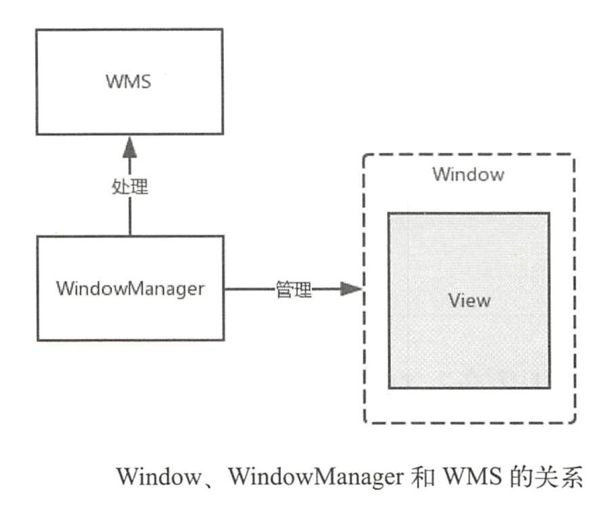
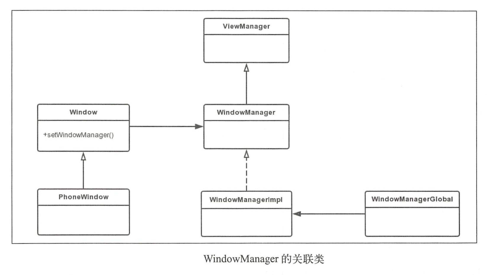
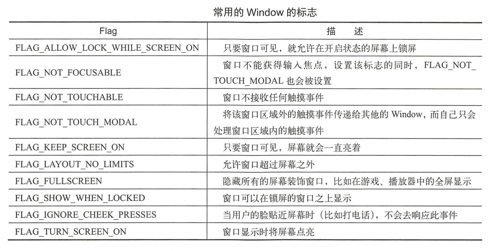
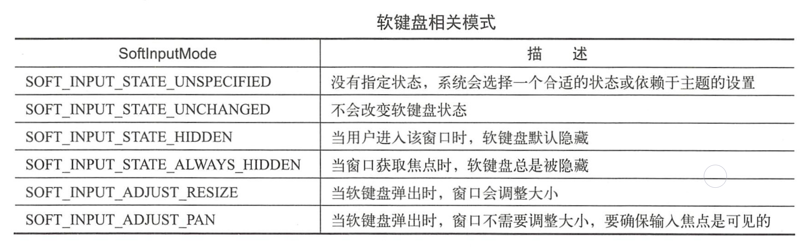
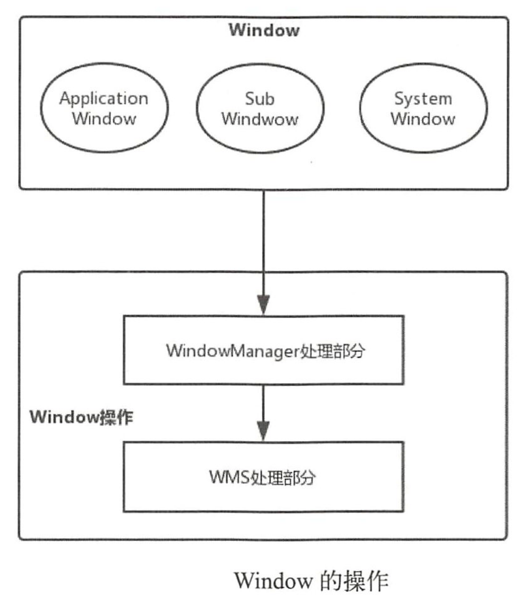
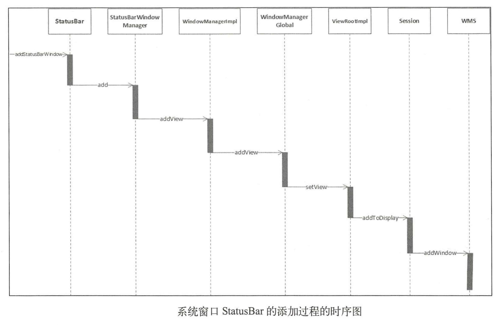
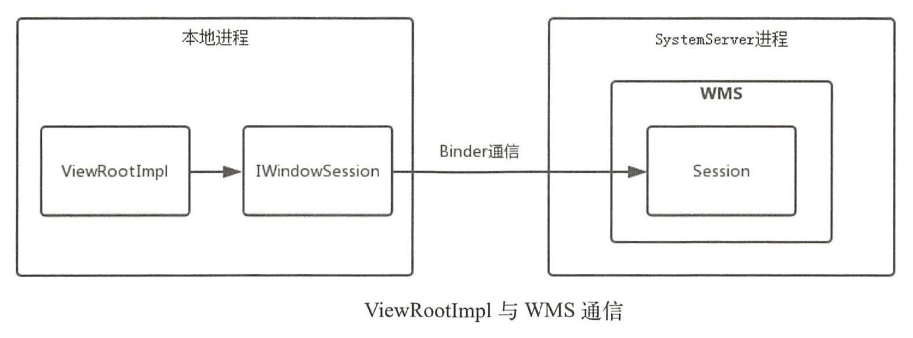

# 理解WindowManager

# Window、WindowManager和WMS

> Window是一个抽象类，具体实现类为PhoneWindow，它对View进行管理。WindowManager是一个接口，继承自接口ViewManager，其作用是管理Window的，具体实现类为WindowManagerImpl。如果我们想要对Window(View)进行添加、更新和删除操作就可以使用WindowManager，WindowManager会将具体的工作交由WMS来处理，WindowManager与WMS通过Binder来进行跨进程通信。

Window、WindowManager和WMS的关系如下：



# WindowManager的关联类

Window是一个抽象类，具体实现类是PhoneWindow，那么PhoneWindow是在何时被创建的呢？在Activity启动过程中会调用ActivityThread的performLaunchActivity方法，performLaunchActivity方法又会调用Activity的attach方法，PhoneWindow就是在这个方法中被创建的。

```java
final void attach(Context context, ActivityThread aThread,
        Instrumentation instr, IBinder token, int ident,
        Application application, Intent intent, ActivityInfo info,
        CharSequence title, Activity parent, String id,
        NonConfigurationInstances lastNonConfigurationInstances,
        Configuration config, String referrer, IVoiceInteractor voiceInteractor,
        Window window, ActivityConfigCallback activityConfigCallback) {
    attachBaseContext(context);

    mFragments.attachHost(null /*parent*/);
    //创建PhoneWindow
    mWindow = new PhoneWindow(this, window, activityConfigCallback);
    mWindow.setWindowControllerCallback(this);
    mWindow.setCallback(this);
    mWindow.setOnWindowDismissedCallback(this);
    mWindow.getLayoutInflater().setPrivateFactory(this);
    if (info.softInputMode != WindowManager.LayoutParams.SOFT_INPUT_STATE_UNSPECIFIED) {
        mWindow.setSoftInputMode(info.softInputMode);
    }
    if (info.uiOptions != 0) {
        mWindow.setUiOptions(info.uiOptions);
    }
    mUiThread = Thread.currentThread();

    mMainThread = aThread;
    mInstrumentation = instr;
    mToken = token;
    mIdent = ident;
    mApplication = application;
    mIntent = intent;
    mReferrer = referrer;
    mComponent = intent.getComponent();
    mActivityInfo = info;
    mTitle = title;
    mParent = parent;
    mEmbeddedID = id;
    mLastNonConfigurationInstances = lastNonConfigurationInstances;
    if (voiceInteractor != null) {
        if (lastNonConfigurationInstances != null) {
            mVoiceInteractor = lastNonConfigurationInstances.voiceInteractor;
        } else {
            mVoiceInteractor = new VoiceInteractor(voiceInteractor, this, this,Looper.myLooper());
        }
    }
    //这里会经过层层调用把WindowManagerImpl实例传给mWindow
    mWindow.setWindowManager(
            (WindowManager)context.getSystemService(Context.WINDOW_SERVICE),
            mToken, mComponent.flattenToString(),
            (info.flags & ActivityInfo.FLAG_HARDWARE_ACCELERATED) != 0);
    if (mParent != null) {
        mWindow.setContainer(mParent.getWindow());
    }
    mWindowManager = mWindow.getWindowManager();
    mCurrentConfig = config;

    mWindow.setColorMode(info.colorMode);
}
```



PhoneWindow继承自Window，Window通过setWindowManager方法与WindowManager发送关联。WindowManager继承自接口ViewManager，WindowManagerImpl是WindowManager接口的实现类，但是具体的功能会委托给WindowManagerGlobal来实现。

注意：

- WindowManagerGlobal是单例，全局只有一个实例
- WindowManagerImpl会有多个实例

# Window的属性

其定义在WindowManager的内部类LayoutParams中。

## Window类型和显示次序

> Window的类型有很多种，比如应用程序窗口、系统错误窗口、输入法窗口、PopupWindow、Toast、Dialog等。但总的来说Window分为三大类型，分别是Application Window（应用程序窗口）、Sub Window（子窗口）、System Window（系统窗口）。

### 应用程序窗口

```java
/**
 *	WindowManager.java
 */
public static final int FIRST_APPLICATION_WINDOW = 1;//应用程序窗口类型初始值
public static final int TYPE_BASE_APPLICATION   = 1;//窗口的基础值，其他的窗口值要大于这个值
public static final int TYPE_APPLICATION        = 2;//普通的应用程序窗口类型
public static final int TYPE_APPLICATION_STARTING = 3;//应用程序启动窗口类型，用于系统在应用程序窗口启动前显示的窗口
public static final int TYPE_DRAWN_APPLICATION = 4;
public static final int LAST_APPLICATION_WINDOW = 99;//表示应用程序窗口类型的结束值，也就是说应用程序窗口的Type值范围为1~99
```

### 子窗口

不能独立存在，只能依附在其他窗口下。如：PopupWindow

```java
/**
 *  WindowManager.java
 */
public static final int FIRST_SUB_WINDOW = 1000;//子窗口类型初始值
public static final int TYPE_APPLICATION_PANEL = FIRST_SUB_WINDOW;
public static final int TYPE_APPLICATION_MEDIA = FIRST_SUB_WINDOW + 1;
public static final int TYPE_APPLICATION_SUB_PANEL = FIRST_SUB_WINDOW + 2;
public static final int TYPE_APPLICATION_ATTACHED_DIALOG = FIRST_SUB_WINDOW + 3;
public static final int TYPE_APPLICATION_MEDIA_OVERLAY  = FIRST_SUB_WINDOW + 4;
public static final int TYPE_APPLICATION_ABOVE_SUB_PANEL = FIRST_SUB_WINDOW + 5;
public static final int LAST_SUB_WINDOW = 1999;//子窗口类型结束值
```

### 系统窗口

```java
/**
 *  WindowManager.java
 */
public static final int FIRST_SYSTEM_WINDOW     = 2000;//系统窗口类型初始值
public static final int TYPE_STATUS_BAR         = FIRST_SYSTEM_WINDOW;//系统状态栏窗口
public static final int TYPE_SEARCH_BAR         = FIRST_SYSTEM_WINDOW+1;//搜索条窗口
public static final int TYPE_PHONE              = FIRST_SYSTEM_WINDOW+2;//通话窗口
public static final int TYPE_SYSTEM_ALERT       = FIRST_SYSTEM_WINDOW+3;//系统alert窗口
public static final int TYPE_KEYGUARD           = FIRST_SYSTEM_WINDOW+4;//锁屏窗口
public static final int TYPE_TOAST              = FIRST_SYSTEM_WINDOW+5;//Toast窗口
public static final int FIRST_SYSTEM_WINDOW     = 2000;//系统窗口类型结束值
```

###  窗口显示次序

当一个进程想WMS申请一个窗口时，WMS会为窗口确定显示次序。一般得type值越大显示越靠前，但实际显示会比较复杂。

## Window的标志

Window的标志也就是Flag，用于控制Window的显示，也定义在LayoutParams中。



设置Window的Flag有三种方法。

第一种是通过Window的addFlags：

```java
Window mWindow = getWindow();
mWindow.addFlags(WindowManager.LayoutParams.FLAG_FULLSCREEN);
```

第二种通过Window的setFlags：

```java
Window mWindow = getWindow();
mWindow.setFlags(WindowManager.LayoutParams.FLAG_FULLSCREEN,WindowManager.LayoutParams.FLAG_FULLSCREEN);
```

第三种是给LayoutParams设置Flag：

```java
WindowManager.LayoutParams mWindowLayoutParams = new WindowManager.LayoutParams();
mWindowLayoutParams.flags = WindowManager.LayoutParams.FLAG_FULLSCREEN;
WindowManager mWindowManager = (WindowManager) getSystemService(Context.WINDOW_SERVICE);
TextView mTextView = new TextView(this);
mWindowManager.addView(mTextView,mWindowLayoutParams);
```

## 软键盘相关模式



可以在AndroidManifest中Activity的`android:windowSoftInputMode`属性或通过`getWindow().setSoftInputMode(WindowManger.LayoutParams.SOFT_INPUT_ADJUST_RESIZE);`来设置。

# Window的操作

WindowManager就是对Windows进行管理，所谓的管理就是对Window进行添加、更新和删除操作。对Window的操作最终都是交给WMS来进行处理的。



## 系统窗口的添加过程

以StatusBar为例



其中ViewRootImpl与WMS通信需要使用Session对象，每个应用程序进程都会对应一个Session，WMS会用ArrayList来保存这写Session。



## Activity添加过程


## Window的更新过程