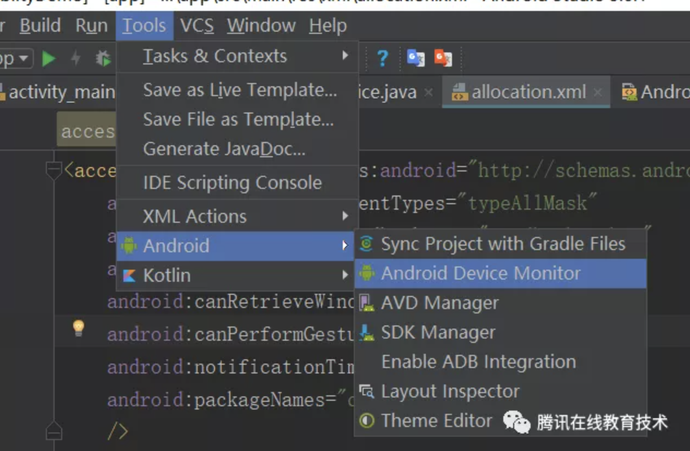

## Android辅助服务AccessibilityService实践总结

### 一.前言

最近在写运营助手的时候，接触了Android辅助服务，即AccessibilityService的相关内容，也算是解决了我一直以来的困惑——某些具有自动化功能的手机插件是怎么实现的。这两天，抽空总结一下这一部分相关的内容，本篇文章将重点介绍辅助服务的实践方法。

### 二.概述

#### 1.辅助服务是什么

辅助服务的设计初衷提供给无法和界面进行交互的残疾用户。来协助帮助他们进行一些用户操作，比如点击，返回，长按，获取屏幕信息等能力。后来被开发者另辟蹊径，用于一些插件开发，做一些监听第三方应用的插件。

下面是辅助服务的继承关系：


#### 2.辅助服务生命周期

辅助服务的生命周期由系统专门管理，并遵循Server的生命周期。服务的启动只能用户在设备设置中明确启动服务来触发。当系统绑定到服务后，它会调用AccessibilityService#onServiceConnected()方法。当用户在设置设置中关闭时，辅助服务功能将停止，或者调用AccessibilityService#disableSelf()方法。giant服务会被关闭销毁

设备设置无障碍选择：


下面是关于AccessibilityService的使用。

### 三.配置

#### 1.继承AccessbilityService类

要使用辅助服务，首先先继承AccessbilityService类，并且重写其方法。

```java
public class StatusAccessibilityService extends AccessibilityService {
	/**
	 * 发生用户界面事件回调此事件
	 * @param event
	 */
	@Override
	public void onAccessibilityEvent(AccessibilityEvent event) {
	}
	/**
	 * 中断可访问性反馈
	 */
	@Override
	public void onInterrupt() {
	}
}
```

除了上面的两个必须要重写的方法外，AccessbilityService还提供了下面的一些方法：

- disableSelf()，禁用当前服务，也就是说关闭当服务

- dispatchGesture(GestureDescription gesture,

  AccessibilityService.GestureResultCallback callback, Handler handler)，将手势发送到触摸屏

- findFocus(int focus)：寻找到具有指定焦点类型的视图。

- getRootInActiveWindow()：获取当前活动窗口中的根节点。

- getServiceInfo()：获取当前服务的配置信息

- getSystemService(String name)：获取系统服务

- getWindows():获取屏幕上的窗口。

- performGlobalAction(int action)：执行全局操作：比如返回，回到主页，打开最近等操作

- setServiceInfo(AccessibilityServiceInfo info):设置当前服务的配置信息 (下面的配置AccessbilityService会介绍)

不太常用的：

- getAccessibilityButtonController()：返回系统导航区域内辅助功能按钮的控制器。
- getFingerprintGestureController()：获取指纹手势的控制器。
- getMagnificationController():返回放大器控制器，可用于查询和修改显示放大率的状态。
- getSoftKeyboardController():返回软键盘控制器，可用于查询和修改软键盘显示模式。

#### 2.在AndroidManifest中注册该服务

AccessbilityService是一个服务，所以同样，他也要在AndroidManifest中注册：

```xml
<service    
	android:name="com.hahak.walle.accessibilitydame.StatusAccessibilityService"
	android:label="辅助服务测试"
	android:permission="android.permission.BIND_ACCESSIBILITY_SERVICE">
	<intent-filter>
		<action android:name="android.accessibilityservice.AccessibilityService"/>
	</intent-filter>
</service>
```

- android:permission：需要指定BINDACCESSIBILITYSERVICE权限，这是4.0以上的系统要求的
- intent-filter：这个name是固定不变的

#### 3.配置AccessbilityService

接下来，就是配置服务参数，即设定AccessbilityService所能干的事。配置方法有两种，一种是在代码中动态设置，一种是写配置文件。

**方法1.写配置文件**首先在AndroidManifest中生命配置文件的位置

```xml
<service
	android:name="com.hahack.walle.AutoCheckStatusAccessibilityService"
	android:label="运营助手：自动艾特用户"
	android:permission="android.permission.BIND_ACCESSIBILITY_SERVICE">
	<intent-filter>
		<action android:name="android.accessibilityservice.AccessibilityService"/>
	</intent-filter>
  	<meta-data
    		android:name="android.accessibilityservice"
    		android:resource="@xml/allocation"/>
</service>
```

其次，在@xml/allocation文件中，声明下面的内容

```xml
<accessibility-service xmlns:android="http://schemas.android.com/apk/res/android"
    android:accessibilityEventTypes="typeAllMask"
    android:description="demo"
    android:accessibilityFeedbackType="feedbackSpoken"
    android:canRetrieveWindowContent="true"
    android:notificationTimeout="1000"/>
```

**方法2.在代码中动态添加**在自定义的AccessibilityService类中，可以通过在AccessibilityServiceInfo类重写onServiceConnected()，并通过 this.setServiceInfo来添加配置

```java
@Override
public void onServiceConnected() {
    info.eventTypes = AccessibilityEvent.TYPE_VIEW_CLICKED | AccessibilityEvent.TYPE_VIEW_FOCUSED;
    info.packageNames = new String[] {"com.example.android.myFirstApp","com.example.android.mySecondApp"};
    info.feedbackType = AccessibilityServiceInfo.FEEDBACK_SPOKEN;
    info.notificationTimeout = 100;
    this.setServiceInfo(info);
}
```

下面说说配置内容的具体含义：

- accessibilityEventTypes：此服务希望按照指定接收的事件(AccessibilityEvent)

| 常量                     | 描述         |
| :----------------------- | :----------- |
| typeViewClicked          | 点击事件     |
| typeViewSelected         | view被选择   |
| typeViewScrolled         | 滑动事件     |
| typeWindowContentChanged | 窗口内容该表 |
| typeAllMask              | 所有事件     |

- accessibilityFeedbackType：此服务提供的反馈类型，比如说是语音播报还是真的震动

| 常量            | 描述             |
| :-------------- | :--------------- |
| feedbackSpoken  | 语音反馈         |
| feedbackHaptic  | 触觉（震动）反馈 |
| feedbackAudible | 音频反馈         |
| feedbackVisual  | 视频反馈         |
| feedbackGeneric | 通用反馈         |
| feedbackAllMask | 以上都具有       |

- canRetrieveWindowContent：表示该服务能否访问活动窗口中的内容。也就是如果你希望在服务中获取窗体内容，则需要设置其值为true
- description：对该无障碍功能的描述。
- notificationTimeout：接受事件的时间间隔，通常将其设置为100即可
- packageNames：表示对该服务是用来监听哪个包的产生的事件
- canPerformGestures:表示是否允许进行手势分发
- canRequestFilterKeyEvents：辅助服务希望能够请求过滤关键事件。
- nonInteractiveUiTimeout：超时设置，未不包含交互式空间返回合适的值

### 四.使用

#### 1.启动服务

辅助服务的启动必须通过用户设置来开启，所以我们要先提醒用户进行无障碍功能列表

```java
Intent intent = new Intent(Settings.ACTION_ACCESSIBILITY_SETTINGS);
startActivity(intent);
```

通过上面的代码就可以打开系统的无障碍功能列表

#### 2.获取事件信息

当我们监听的目标应用界面或者界面等信息，会通过onAccessibilityEvent回调我们的事件，接着进行事件的处理。

```java
@Override
public void onAccessibilityEvent(final AccessibilityEvent event) {
    String packageName = event.getPackageName().toString();
    if (!packageName.equals("com.tencent.mm")) {
        return;
    }
    int eventType = event.getEventType();
    switch (eventType) {
        case AccessibilityEvent.TYPE_WINDOW_STATE_CHANGED:
            //处理
            //....
    }
}
```

可以看出，当发生变化时，回调onAccessibilityEvent方法，并传入AccessibilityEvent类型。下面让我们看看AccessibilityEvent的含义。

先看看AccessibilityEvent提供的方法(源是指触发此方法的ui/时间)：

- getAction()：获取触发此世界的已执行操作
- getEventTime()：获取发送此事件的时间
- getEventType()：获取事件类型。
- getPackageName()：获取源的包名称 从AccessibilityRecord基础的方法
- getMaxScrollY()：获取源上边缘的最大滚动偏移（以像素为单位）
- getMaxScrollX()：获取源左边缘的最大滚动偏移量（以像素为单位）。
- getClassName()：获取源的类名。
- getText()：获取事件的文本，比如事件是有TextView发出的,此时获取的就是TextView的text属性。如果该事件源是树结构，那么此时获取的是这个树上所有具有text属性的值的集合
- getToIndex()：获取滚动时文本选择结束的索引或最后一个可见项的索引。
- getItemCount()：如果事件源是树结构，将返回该树根节点下子节点的数量 更详细的可以参考官方文档：AccessibilityEvent官方api介绍

关于事件类型getEventType()返回值：

- TYPEVIEWLONG_CLICKED 长按事件
- TYPEVIEWCONTEXT_CLICKED点击事件
- TYPEWINDOWSTATE_CHANGED 表示用户界面被更改。
- TYPENOTIFICATIONSTATE_CHANGED：通知栏的改变
- TYPEWINDOWSCHANGED：表示系统窗口的时间变更
- .....还有很多，详情可以看看官方文档

#### 3.处理事件--寻找控件

当我们接受到事件后，根据事件就可以处理对应的时间，比如说检测到弹窗，就可以转换为动作：点击弹窗。处理事件总的来说，分为两个步骤。第一步，寻找该控件。第二部，模拟人的操作对各个控件进行操作(点击，长按，输入，读取)

寻找控件首先要找的它对象窗口内容对应的树，即AccessibilityWindowInfo(代表)和AccessibilityNodeInfo(代表具体的View)。注意，这个功能需要在xml资源配置中声明SERVICEMETADATA。

针对寻找AccessibilityWindowInfo和AccessibilityNodeInfo，谷歌官方提供了下面的api

- AccessibilityEvent#getSource(),返回值为发起当前事件的

  控件的AccessibilityNodeInfo

- AccessibilityService#findFocus(int)，参数表示输入焦点，返回值为指定焦点对应的AccessibilityNodeInfo

- AccessibilityService#getWindows()，返回值为当前所有可交互窗户的

  AccessibilityWindowInfo列表（List）

- AccessibilityService#getRootInActiveWindow()，返回值为当前活动的

  AccessibilityWindowInfo，如果用户没有触摸任何窗口，则活动窗口是具有输入焦点的窗口。

**AccessibilityWindowInfo**：AccessibilityWindowInfo表示可访问窗口的状态快照。屏幕内容包含一个或者多个窗口，其中一些窗口可以是其他窗口的后代，窗口是次序排序的。AccessibilityWindowInfor提供的api简介：

- getChild(int index) ，返回给定索引处的子窗口的AccessibilityWindowInfo
- getChildCount()，返回代表子窗口的数量的int值
- getId(),返回代表唯一的窗口id的int值
- getParent()，返回代表父窗口的AccessibilityWindowInfo
- getLayer()，返回代表窗口在z轴的图层的int值
- getRoot()，返回代表窗口层次中根节点的AccessibilityNodeInfo
- ....其余详见官网文档

**AccessibilityNodeInfo**：AccessibilityNodeInfo表示窗口内容的节点以及可以进行的操作。AccessibilityNodeInfo内部类介绍：

- AccessibilityAction，表示可以对

  AccessibilityNodeInfo提供的操作

- CollectionInfo，表示当节点是集合时，包含集合信息的类。

- CollectionItemInfo，表示当节点是集合子项，包含集合子项信息的类。

- RangeInfo，表示当节点是范围，包含该范围包含信息的类。

- addAction(action: AccessibilityNodeInfo.AccessibilityAction)/(action: Int)，添加可在节点上执行的操作,有两个同名方法，参数不同

- performAction(action: Int)，在节点上执行操作

- addChild(child: View!)添加一个子项

- findAccessibilityNodeInfosByText(text: String!)，按文字寻找对应的控件，并返回其 AccessibilityNodeInfo

- findAccessibilityNodeInfosByViewId(viewId: String!)，根据View的id资源名称查找对应的View，返回AccessibilityNodeInfo

- findFocus(focus: Int)，找到具有指定焦点类型的视图。

  返回AccessibilityNodeInfo

- focusSearch(direction: Int)，搜索指定方向上可以获取输入焦点的最近视图。返回AccessibilityNodeInfo

- getActionList()，获取可以在节点上执行的操作。

- getHintText()，获取此节点的提示文本

- getText()，获取此节点的文本

- isClickable()，获取此节点是否可单击，还有其他对于的方法，判断节点是否可操作

- ....其余详见官网文档

#### 4.处理事件--操作控件

在上面一小节里，我们通过addAction，可以给AccessibilityNodeInfo添加对于的动作，其参数是 AccessibilityNodeInfo的内部类AccessibilityAction。

AccessibilityAction表示可以对AccessibilityNodeInfo。每个操作都有一个唯一的ID，这是必需的和可选的数据。其有三类动作

- 标准操作 - 这些操作由平台中的标准UI小部件报告和处理。对于每个标准动作，在该类中定义了一个静态常量，例如ACTION_FOCUS。这些操作将有null标签。
- 自定义操作操作 - 这些是由自定义窗口小部件报告和处理的操作。即不属于UI工具包的那些。例如，应用程序可以定义用于清除用户历史的自定义操作。
- 覆盖标准操作 - 这些操作会覆盖标准操作以自定义它们。例如，应用可以向标准ACTION_CLICK操作添加标签，以向用户指示此操作清除浏览历史记录。

可提供的操作

- ACTIONACCESSIBILITYFOCUS，为可访问性提供焦点的操作。
- ACTIONCLEARACCESSIBILITY_FOCUS，清除节点可访问性焦点的操作。
- ACTION_CLICK，单击节点信息的操作。
- ACTIONLONGCLICK,长按
- ACTION_FOCUS，为输入焦点提供节点
- ACTION_COPY，将当前选择复制到剪贴板的操作。
- ACTION_CUT，剪切
- ACTIONPAGEDOWN，移动到下一页，以及移动到下，左，右页面
- ACTION_PASTE，粘贴剪切板内容
- ACTIONSCROLLBACKWARD/ACTIONSCROLLFORWARD ,下滑/上滑
- ACTIONSETTEXT，设置节点文本
- ....其余详见官网文档

### 五.综合应用

#### 1.获得View对应的id

- 打开tools-->Android-->Android Device Monito

  

- 选择设备，并点击图中坐标

  

- 选择对应的控件进行点击查看

  

#### 2.AccessibilityService的手势控制

在Android7.0之后，AccessibilityService又增加了一个新的方法dispatchGesture。可以将手势发送到触摸屏上。但是要使用这个功能必须在配置文件中声明，canPerformGestures = “true”

api接口:

```java
public final boolean dispatchGesture(GestureDescription gesture, AccessibilityService.GestureResultCallback callback, Handler handler);
```

参数:

- GestureDescription：要分派的手势
- AccessibilityService.GestureResultCallback:完成后的回调
- Handler；处理回调程序的线程，如果传入null,则为主线程

使用示例

```java
Path path = new Path();
path.moveTo(0,400);
path.lineTo(400,400);
final GestureDescription.StrokeDescription sd;
sd=new GestureDescription.StrokeDescription(path,100,50);
//先横滑
boolean flag = this.dispatchGesture(new GestureDescription.Builder().addStroke(sd).build(), new AccessibilityService.GestureResultCallback() {
    @Overridepublic
    void onCompleted(GestureDescription gestureDescription) {
        super.onCompleted(gestureDescription);
        Log.d("22222", "onCompleted:横滑 ");
        Path path2 = new Path();
        path2.moveTo(600, 600);
        path2.lineTo(600, 800);
        final GestureDescription.StrokeDescription sd2 = new GestureDescription.StrokeDescription(path2, 1000, 500);
        //滑完后再过1秒竖滑
        BaseAccessibilityService.this.dispatchGesture(new GestureDescription.Builder().addStroke(sd2)/*.addStroke(sd2)*/.build(), null, null);
    }
    @Overridepublic
    void onCancelled(GestureDescription gestureDescription) {
        Log.d("22222", "onCancelled");
        super.onCancelled(gestureDescription);
    }
}, null);
```

上图的示例为左滑和下滑，如果要实现点击事件，则可以只传入一个点Path。即

```java
Path path = new Path();
path.moveTo(0, 400);
sd = new GestureDescription.StrokeDescription(path, 100, 50);
```

#### 3.AccessibilityService的基础类

下面是对AccessibilityService提供的各种方法的封装

```java
public class BaseAccessibilityService extends AccessibilityService {
    private AccessibilityManager mAccessibilityManager;
    private Context mContext;
    private static BaseAccessibilityService mInstance;

    public void init(Context context) {
        mContext = context.getApplicationContext();
        mAccessibilityManager = (AccessibilityManager) mContext.getSystemService(Context.ACCESSIBILITY_SERVICE);
    }

    public static BaseAccessibilityService getInstance() {
        if (mInstance == null) {
            mInstance = new BaseAccessibilityService();
        }
        return mInstance;
    }

    /**
     * Check当前辅助服务是否启用
     * @param serviceName serviceName
     * @return 是否启用
     */
    private boolean checkAccessibilityEnabled(String serviceName) {
        List<AccessibilityServiceInfo> accessibilityServices = mAccessibilityManager.getEnabledAccessibilityServiceList(AccessibilityServiceInfo.FEEDBACK_GENERIC);
        for (AccessibilityServiceInfo info : accessibilityServices) {
            if (info.getId().equals(serviceName)) {
                return true;
            }
        }
        return false;
    }

    /**
     * 前往开启辅助服务界面
     */
    public void goAccess() {
        Intent intent = new Intent(Settings.ACTION_ACCESSIBILITY_SETTINGS);
        intent.setFlags(Intent.FLAG_ACTIVITY_NEW_TASK);
        mContext.startActivity(intent);
    }

    /**
     * 模拟点击事件
     *
     * @param nodeInfo nodeInfo
     */
    public void performViewClick(AccessibilityNodeInfo nodeInfo) {
        if (nodeInfo == null) {
            return;
        }
        while (nodeInfo != null) {
            if (nodeInfo.isClickable()) {
                nodeInfo.performAction(AccessibilityNodeInfo.ACTION_CLICK);
                break;
            }
            nodeInfo = nodeInfo.getParent();
        }
    }

    /**
     * 模拟返回操作
     */
    public void performBackClick() {
        try {
            Thread.sleep(500);
        } catch (InterruptedException e) {
            e.printStackTrace();
        }
        performGlobalAction(GLOBAL_ACTION_BACK);
    }

    /**
     * 模拟下滑操作
     */
    public void performScrollBackward() {
        try {
            Thread.sleep(500);
        } catch (InterruptedException e) {
            e.printStackTrace();
        }
        performGlobalAction(AccessibilityNodeInfo.ACTION_SCROLL_BACKWARD);
    }

    /**
     * 模拟上滑操作
     */
    @RequiresApi(api = Build.VERSION_CODES.N)
    public void performScrollForward() {
        try {
            Thread.sleep(500);
        } catch (InterruptedException e) {
            e.printStackTrace();
        }
        performGlobalAction(AccessibilityNodeInfo.ACTION_SCROLL_FORWARD);
    }

    /**
     * 查找对应文本的View
     * @param text text
     * @return View
     */
    public AccessibilityNodeInfo findViewByText(String text) {
        return findViewByText(text, false);
    }

    /**
     * 查找对应文本的View
     *
     * @param text      text
     * @param clickable 该View是否可以点击
     * @return View
     */
    public AccessibilityNodeInfo findViewByText(String text, boolean clickable) {
        AccessibilityNodeInfo accessibilityNodeInfo = getRootInActiveWindow();
        if (accessibilityNodeInfo == null) {
            return null;
        }
        List<AccessibilityNodeInfo> nodeInfoList = accessibilityNodeInfo.findAccessibilityNodeInfosByText(text);
        if (nodeInfoList != null && !nodeInfoList.isEmpty()) {
            for (AccessibilityNodeInfo nodeInfo : nodeInfoList) {
                if (nodeInfo != null && (nodeInfo.isClickable() == clickable)) {
                    return nodeInfo;
                }
            }
        }
        return null;
    }

    /**
     * 查找对应ID的View
     *
     * @param id id
     * @return View
     */
    @TargetApi(Build.VERSION_CODES.JELLY_BEAN_MR2)
    public AccessibilityNodeInfo findViewByID(String id) {
        AccessibilityNodeInfo accessibilityNodeInfo = getRootInActiveWindow();
        if (accessibilityNodeInfo == null) {
            return null;
        }
        List<AccessibilityNodeInfo> nodeInfoList = accessibilityNodeInfo.findAccessibilityNodeInfosByViewId(id);
        if (nodeInfoList != null && !nodeInfoList.isEmpty()) {
            Log.d("dd", "findViewByID: " + nodeInfoList.size());
            for (AccessibilityNodeInfo nodeInfo : nodeInfoList) {
                Log.d("dd", "findViewByID: " + nodeInfo.toString());
                if (nodeInfo != null) {
                    return nodeInfo;
                }
            }
        }
        return null;
    }

    public void clickTextViewByText(String text) {
        AccessibilityNodeInfo accessibilityNodeInfo = getRootInActiveWindow();
        if (accessibilityNodeInfo == null) {
            return;
        }
        List<AccessibilityNodeInfo> nodeInfoList = accessibilityNodeInfo.findAccessibilityNodeInfosByText(text);
        if (nodeInfoList != null && !nodeInfoList.isEmpty()) {
            for (AccessibilityNodeInfo nodeInfo : nodeInfoList) {
                if (nodeInfo != null) {
                    performViewClick(nodeInfo);
                    break;
                }
            }
        }
    }

    @TargetApi(Build.VERSION_CODES.JELLY_BEAN_MR2)
    public void clickTextViewByID(String id) {
        AccessibilityNodeInfo accessibilityNodeInfo = getRootInActiveWindow();
        if (accessibilityNodeInfo == null) {
            return;
        }
        List<AccessibilityNodeInfo> nodeInfoList = accessibilityNodeInfo.findAccessibilityNodeInfosByViewId(id);
        if (nodeInfoList != null && !nodeInfoList.isEmpty()) {
            for (AccessibilityNodeInfo nodeInfo : nodeInfoList) {
                if (nodeInfo != null) {
                    performViewClick(nodeInfo);
                    break;
                }
            }
        }
    }

    /**
     * 模拟输入
     *
     * @param nodeInfo nodeInfo
     * @param text     text
     */
    public void inputText(AccessibilityNodeInfo nodeInfo, String text) {
        if (Build.VERSION.SDK_INT >= Build.VERSION_CODES.LOLLIPOP) {
            Bundle arguments = new Bundle();
            arguments.putCharSequence(AccessibilityNodeInfo.ACTION_ARGUMENT_SET_TEXT_CHARSEQUENCE, text);
            nodeInfo.performAction(AccessibilityNodeInfo.ACTION_SET_TEXT, arguments);
        } else if (Build.VERSION.SDK_INT >= Build.VERSION_CODES.JELLY_BEAN_MR2) {
            ClipboardManager clipboard = (ClipboardManager) getSystemService(Context.CLIPBOARD_SERVICE);
            ClipData clip = ClipData.newPlainText("label", text);
            clipboard.setPrimaryClip(clip);
            nodeInfo.performAction(AccessibilityNodeInfo.ACTION_FOCUS);
            nodeInfo.performAction(AccessibilityNodeInfo.ACTION_PASTE);
        }
    }

    @Override
    public void onAccessibilityEvent(AccessibilityEvent event) {
        Log.d("dd", "onAccessibilityEvent: " + event.toString());
    }

    @Override
    public void onInterrupt() {
    }

    @Override
    protected void onServiceConnected() {
        super.onServiceConnected();
        Log.d("llll", "onServiceConnected: ");
    }
}
```

#### 4.实际应用

学习了大部分的AccessibilityService相关知识。就可以灵活运用这些内容进行组装。比如说：

- 自动打卡
- 自动签到
- 自动点赞
- ...

### 六.参考资料

官方api文档：(https://developer.android.google.cn/reference/android/accessibilityservice/AccessibilityService.html#lifecycle) 

官网辅助服务介绍：(https://developer.android.google.cn/guide/topics/ui/accessibility/index.html)