# 前言

- 自定义`View`是`Android`开发者必须了解的基础
- 网上有大量关于自定义`View`原理的文章，但存在一些问题：**内容不全、思路不清晰、无源码分析、简单问题复杂化 等**
- 今天，我将全面总结自定义View原理中的`measure`过程，我能保证这是**市面上的最全面、最清晰、最易懂的**

> 文章较长，建议收藏等充足时间再进行阅读

------

# 目录


------

# 1. 作用

测量View的宽 / 高

> 1. 在某些情况下，需要多次测量measure才能确定View最终的宽/高；
> 2. 该情况下，measure过程后得到的宽 / 高可能不准确；
> 3. 此处建议：在layout过程中`onLayout()`去获取最终的宽 / 高

------

# 2. 储备知识

了解measure过程前，需要先了解传递尺寸（宽 / 高测量值）的2个类：

- ViewGroup.LayoutParams类
- MeasureSpecs 类（父视图对子视图的测量要求）

## 2.1 ViewGroup.LayoutParams

- 【简介】
  布局参数类

> 1. ViewGroup的子类（RelativeLayout、LinearLayout）有其对应的`ViewGroup.LayoutParams`子类
> 2. 如：RelativeLayout的 ViewGroup.LayoutParams子类 = RelativeLayoutParams

- 【作用】
  指定视图View的高度height和 宽度width等布局参数。

- 【具体使用】
  通过以下参数指定

| 参数         |                             解释                             |
| ------------ | :----------------------------------------------------------: |
| 具体值       |                           dp / px                            |
| fill_parent  |  强制性使子视图的大小扩展至与父视图大小相等（不含 padding )  |
| match_parent |        与fill_parent相同，用于Android 2.3 & 之后版本         |
| wrap_content | 自适应大小，强制性地使视图扩展以便显示其全部内容(含 padding ) |

```cpp
android:layout_height="wrap_content"   //自适应大小  
android:layout_height="match_parent"   //与父视图等高  
android:layout_height="fill_parent"    //与父视图等高  
android:layout_height="100dip"         //精确设置高度值为 100dip  
```

- 【构造函数】
  构造函数 = View的入口，可用于初始化 & 获取自定义属性

```java
// View的构造函数有四种重载
    public DIY_View(Context context){
        super(context);
    }

    public DIY_View(Context context,AttributeSet attrs){
        super(context, attrs);
    }

    public DIY_View(Context context,AttributeSet attrs,int defStyleAttr ){
        super(context, attrs,defStyleAttr);

// 第三个参数：默认Style
// 默认Style：指在当前Application或Activity所用的Theme中的默认Style
// 且只有在明确调用的时候才会生效，
    }
    
    public DIY_View(Context context,AttributeSet attrs,int defStyleAttr ，int defStyleRes){
        super(context, attrs，defStyleAttr，defStyleRes);
    }

// 最常用的是1和2
}
```

# 2.2 MeasureSpec

### 2.2.1 简介

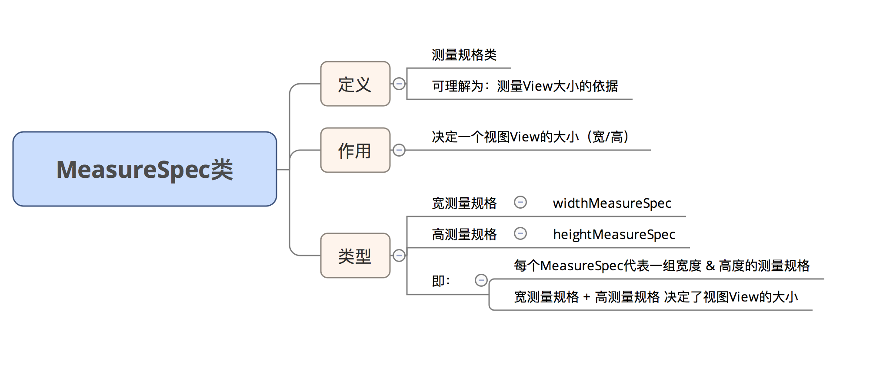

### 2.2.2 组成

测量规格 MeasureSpec = 测量模式mode + 测量大小size

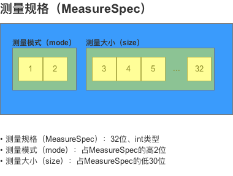

其中，测量模式Mode的类型有3种：UNSPECIFIED、EXACTLY和AT_MOST。具体如下：

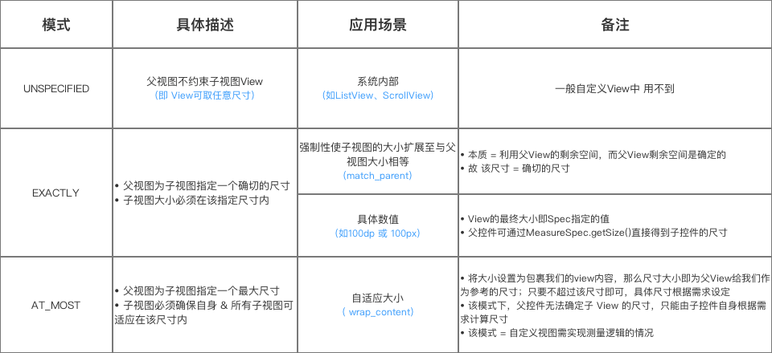

### 2.2.3 具体使用

- MeasureSpec被封装在View类中的一个内部类里
- MeasureSpec类用1个变量封装了2个数据（size，mode）：**通过使用二进制**，将测量模式mode&测量大小size打包成一个int值来，并提供了打包 & 解包的方法

> 该措施的目的 = 减少对象内存分配

- 实际使用

```cpp
/**
  * MeasureSpec类的具体使用
  **/

    // 1. 获取测量模式（Mode）
    int specMode = MeasureSpec.getMode(measureSpec)

    // 2. 获取测量大小（Size）
    int specSize = MeasureSpec.getSize(measureSpec)

    // 3. 通过Mode 和 Size 生成新的SpecMode
    int measureSpec=MeasureSpec.makeMeasureSpec(size, mode);
```

- 源码分析

```java
/**
  * MeasureSpec类的源码分析
  **/
    public class MeasureSpec {

        // 进位大小 = 2的30次方
        // int的大小为32位，所以进位30位 = 使用int的32和31位做标志位
        private static final int MODE_SHIFT = 30;  
          
        // 运算遮罩：0x3为16进制，10进制为3，二进制为11
        // 3向左进位30 = 11 00000000000(11后跟30个0)  
        // 作用：用1标注需要的值，0标注不要的值。因1与任何数做与运算都得任何数、0与任何数做与运算都得0
        private static final int MODE_MASK  = 0x3 << MODE_SHIFT;  
  
        // UNSPECIFIED的模式设置：0向左进位30 = 00后跟30个0，即00 00000000000
        // 通过高2位
        public static final int UNSPECIFIED = 0 << MODE_SHIFT;  
        
        // EXACTLY的模式设置：1向左进位30 = 01后跟30个0 ，即01 00000000000
        public static final int EXACTLY = 1 << MODE_SHIFT;  

        // AT_MOST的模式设置：2向左进位30 = 10后跟30个0，即10 00000000000
        public static final int AT_MOST = 2 << MODE_SHIFT;  
  
        /**
          * makeMeasureSpec（）方法
          * 作用：根据提供的size和mode得到一个详细的测量结果吗，即measureSpec
          **/ 
            public static int makeMeasureSpec(int size, int mode) {  
            
                return size + mode;  
            // measureSpec = size + mode；此为二进制的加法 而不是十进制
            // 设计目的：使用一个32位的二进制数，其中：32和31位代表测量模式（mode）、后30位代表测量大小（size）
            // 例如size=100(4)，mode=AT_MOST，则measureSpec=100+10000...00=10000..00100  

            }  
      
        /**
          * getMode（）方法
          * 作用：通过measureSpec获得测量模式（mode）
          **/    

            public static int getMode(int measureSpec) {  
             
                return (measureSpec & MODE_MASK);  
                // 即：测量模式（mode） = measureSpec & MODE_MASK;  
                // MODE_MASK = 运算遮罩 = 11 00000000000(11后跟30个0)
                //原理：保留measureSpec的高2位（即测量模式）、使用0替换后30位
                // 例如10 00..00100 & 11 00..00(11后跟30个0) = 10 00..00(AT_MOST)，这样就得到了mode的值

            }  
        /**
          * getSize方法
          * 作用：通过measureSpec获得测量大小size
          **/       
            public static int getSize(int measureSpec) {  
             
                return (measureSpec & ~MODE_MASK);  
                // size = measureSpec & ~MODE_MASK;  
               // 原理类似上面，即 将MODE_MASK取反，也就是变成了00 111111(00后跟30个1)，将32,31替换成0也就是去掉mode，保留后30位的size  
            } 

    }  
```

### 2.2.6 MeasureSpec值的计算

- 上面讲了那么久MeasureSpec，那么MeasureSpec值到底是如何计算得来?
- 结论：子View的MeasureSpec值根据**子View的布局参数（LayoutParams）和父容器的MeasureSpec值**计算得来的，具体计算逻辑封装在`getChildMeasureSpec()`里。如下图：

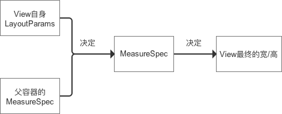

> 即：子view的大小由父view的MeasureSpec值和子view的LayoutParams属性 共同决定

- 下面，我们来看`getChildMeasureSpec()`的源码分析：

```dart
/**
  * 源码分析：getChildMeasureSpec（）
  * 作用：根据父视图的MeasureSpec & 布局参数LayoutParams，计算单个子View的MeasureSpec
  * 注：子view的大小由父view的MeasureSpec值 和 子view的LayoutParams属性 共同决定
  **/

    public static int getChildMeasureSpec(int spec, int padding, int childDimension) {  

         //参数说明
         * @param spec 父view的详细测量值(MeasureSpec) 
         * @param padding view当前尺寸的的内边距和外边距(padding,margin) 
         * @param childDimension 子视图的布局参数（宽/高）

            //父view的测量模式
            int specMode = MeasureSpec.getMode(spec);     

            //父view的大小
            int specSize = MeasureSpec.getSize(spec);     
          
            //通过父view计算出的子view = 父大小-边距（父要求的大小，但子view不一定用这个值）   
            int size = Math.max(0, specSize - padding);  
          
            //子view想要的实际大小和模式（需要计算）  
            int resultSize = 0;  
            int resultMode = 0;  
          
            //通过父view的MeasureSpec和子view的LayoutParams确定子view的大小  


            // 当父view的模式为EXACITY时，父view强加给子view确切的值
           //一般是父view设置为match_parent或者固定值的ViewGroup 
            switch (specMode) {  
            case MeasureSpec.EXACTLY:  
                // 当子view的LayoutParams>0，即有确切的值  
                if (childDimension >= 0) {  
                    //子view大小为子自身所赋的值，模式大小为EXACTLY  
                    resultSize = childDimension;  
                    resultMode = MeasureSpec.EXACTLY;  

                // 当子view的LayoutParams为MATCH_PARENT时(-1)  
                } else if (childDimension == LayoutParams.MATCH_PARENT) {  
                    //子view大小为父view大小，模式为EXACTLY  
                    resultSize = size;  
                    resultMode = MeasureSpec.EXACTLY;  

                // 当子view的LayoutParams为WRAP_CONTENT时(-2)      
                } else if (childDimension == LayoutParams.WRAP_CONTENT) {  
                    //子view决定自己的大小，但最大不能超过父view，模式为AT_MOST  
                    resultSize = size;  
                    resultMode = MeasureSpec.AT_MOST;  
                }  
                break;  
          
            // 当父view的模式为AT_MOST时，父view强加给子view一个最大的值。（一般是父view设置为wrap_content）  
            case MeasureSpec.AT_MOST:  
                // 道理同上  
                if (childDimension >= 0) {  
                    resultSize = childDimension;  
                    resultMode = MeasureSpec.EXACTLY;  
                } else if (childDimension == LayoutParams.MATCH_PARENT) {  
                    resultSize = size;  
                    resultMode = MeasureSpec.AT_MOST;  
                } else if (childDimension == LayoutParams.WRAP_CONTENT) {  
                    resultSize = size;  
                    resultMode = MeasureSpec.AT_MOST;  
                }  
                break;  
          
            // 当父view的模式为UNSPECIFIED时，父容器不对view有任何限制，要多大给多大
            // 多见于ListView、GridView  
            case MeasureSpec.UNSPECIFIED:  
                if (childDimension >= 0) {  
                    // 子view大小为子自身所赋的值  
                    resultSize = childDimension;  
                    resultMode = MeasureSpec.EXACTLY;  
                } else if (childDimension == LayoutParams.MATCH_PARENT) {  
                    // 因为父view为UNSPECIFIED，所以MATCH_PARENT的话子类大小为0  
                    resultSize = 0;  
                    resultMode = MeasureSpec.UNSPECIFIED;  
                } else if (childDimension == LayoutParams.WRAP_CONTENT) {  
                    // 因为父view为UNSPECIFIED，所以WRAP_CONTENT的话子类大小为0  
                    resultSize = 0;  
                    resultMode = MeasureSpec.UNSPECIFIED;  
                }  
                break;  
            }  
            return MeasureSpec.makeMeasureSpec(resultSize, resultMode);  
        }  
```

- 关于`getChildMeasureSpec()`里对子View的测量模式 & 大小的判断逻辑有点复杂；
- 别担心，我已帮大家总结好。具体请看下表：


其中的规律总结：（以子View为标准，横向观察）

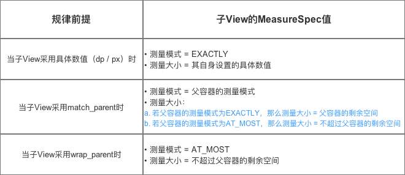

> 由于UNSPECIFIED模式适用于系统内部多次measure情况，很少用到，故此处不讨论

- 注：区别于顶级View（即DecorView）的测量规格MeasureSpec计算逻辑：取决于 **自身布局参数&窗口尺寸**

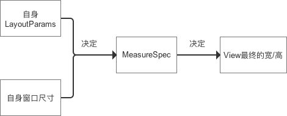

### 2.3 最基本的知识储备

具体请看文章：[自定义View基础 - 最易懂的自定义View原理系列](https://www.jianshu.com/p/146e5cec4863)

------

# 3. measure过程详解

- measure过程 根据**View的类型**分为2种情况：

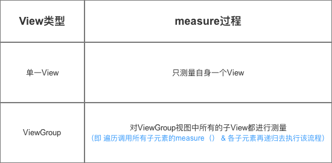

- 接下来，我将详细分析这两种`measure`过程

## 3.1 单一View的measure过程

- 【应用场景】
  在无现成的控件View满足需求、需自己实现时，则使用自定义单一View

> 1. 如：制作一个支持加载网络图片的ImageView控件
> 2. 注：自定义View在多数情况下都有替代方案：图片 / 组合动画，但二者可能会导致内存耗费过大，从而引起内存溢出等问题。

- 【具体使用】
  继承自View、SurfaceView或其他View；不包含子View
- 【具体流程】


下面我将一个个方法进行详细分析：入口 -> measure

```dart
/**
  * 源码分析：measure（）
  * 定义：Measure过程的入口；属于View.java类 & final类型，即子类不能重写此方法
  * 作用：基本测量逻辑的判断
  **/ 

    public final void measure(int widthMeasureSpec, int heightMeasureSpec) {

        // 参数说明：View的宽 / 高测量规格

        ...

        int cacheIndex = (mPrivateFlags & PFLAG_FORCE_LAYOUT) == PFLAG_FORCE_LAYOUT ? -1 :
                mMeasureCache.indexOfKey(key);

        if (cacheIndex < 0 || sIgnoreMeasureCache) {
            
            onMeasure(widthMeasureSpec, heightMeasureSpec);
            // 计算视图大小 ->>分析1

        } else {
            ...
      
    }

/**
  * 分析1：onMeasure（）
  * 作用：a. 根据View宽/高的测量规格计算View的宽/高值：getDefaultSize()
  *      b. 存储测量后的View宽 / 高：setMeasuredDimension()
  **/ 
  protected void onMeasure(int widthMeasureSpec, int heightMeasureSpec) {  
    // 参数说明：View的宽 / 高测量规格

    setMeasuredDimension(getDefaultSize(getSuggestedMinimumWidth(), widthMeasureSpec),  
                         getDefaultSize(getSuggestedMinimumHeight(), heightMeasureSpec));  
    // setMeasuredDimension() ：获得View宽/高的测量值 ->>分析2
    // 传入的参数通过getDefaultSize()获得 ->>分析3
}

/**
  * 分析2：setMeasuredDimension()
  * 作用：存储测量后的View宽 / 高
  * 注：该方法即为我们重写onMeasure()所要实现的最终目的
  **/
    protected final void setMeasuredDimension(int measuredWidth, int measuredHeight) {  

    //参数说明：测量后子View的宽 / 高值

        // 将测量后子View的宽 / 高值进行传递
            mMeasuredWidth = measuredWidth;  
            mMeasuredHeight = measuredHeight;  
          
            mPrivateFlags |= PFLAG_MEASURED_DIMENSION_SET;  
        } 
    // 由于setMeasuredDimension（）的参数是从getDefaultSize()获得的
    // 下面我们继续看getDefaultSize()的介绍

/**
  * 分析3：getDefaultSize()
  * 作用：根据View宽/高的测量规格计算View的宽/高值
  **/
  public static int getDefaultSize(int size, int measureSpec) {  

        // 参数说明：
        // size：提供的默认大小
        // measureSpec：宽/高的测量规格（含模式 & 测量大小）

            // 设置默认大小
            int result = size; 
            
            // 获取宽/高测量规格的模式 & 测量大小
            int specMode = MeasureSpec.getMode(measureSpec);  
            int specSize = MeasureSpec.getSize(measureSpec);  
          
            switch (specMode) {  
                // 模式为UNSPECIFIED时，使用提供的默认大小 = 参数Size
                case MeasureSpec.UNSPECIFIED:  
                    result = size;  
                    break;  

                // 模式为AT_MOST,EXACTLY时，使用View测量后的宽/高值 = measureSpec中的Size
                case MeasureSpec.AT_MOST:  
                case MeasureSpec.EXACTLY:  
                    result = specSize;  
                    break;  
            }  

         // 返回View的宽/高值
            return result;  
        }    
```

- 上面提到，当模式是UNSPECIFIED时，使用的是提供的默认大小（即第一个参数size）；那么，提供的默认大小具体是多少呢？
- 答：在`onMeasure()`方法中，`getDefaultSize(getSuggestedMinimumWidth(), widthMeasureSpec)`中传入的默认大小是`getSuggestedMinimumWidth()`。

接下来我们继续看`getSuggestedMinimumWidth()`的源码分析

> 由于`getSuggestedMinimumHeight()`类似，所以此处仅分析`getSuggestedMinimumWidth()`

- 源码分析如下：

```csharp
protected int getSuggestedMinimumWidth() {
    return (mBackground == null) ? mMinWidth : max(mMinWidth,mBackground.getMinimumWidth());
}

//getSuggestedMinimumHeight()同理
```

从代码可以看出：

- 若 View无设置背景，那么View的宽度 = mMinWidth

> 1. mMinWidth = `android:minWidth`属性所指定的值；
> 2. 若`android:minWidth`没指定，则默认为0

- 若 View设置了背景，View的宽度为mMinWidth和`mBackground.getMinimumWidth()`中的最大值

那么，`mBackground.getMinimumWidth()`的大小具体指多少？继续看`getMinimumWidth()`的源码分析：

```java
public int getMinimumWidth() {
    final int intrinsicWidth = getIntrinsicWidth();
    //返回背景图Drawable的原始宽度
    return intrinsicWidth > 0 ? intrinsicWidth :0 ;
}

// 由源码可知：mBackground.getMinimumWidth()的大小 = 背景图Drawable的原始宽度
// 若无原始宽度，则为0；
// 注：BitmapDrawable有原始宽度，而ShapeDrawable没有
```

总结：`getDefaultSize()`计算View的宽/高值的逻辑


**至此，单一View的宽/高值已经测量完成，即对于单一View的measure过程已经完成。**

### 总结

对于单一View的measure过程，如下：

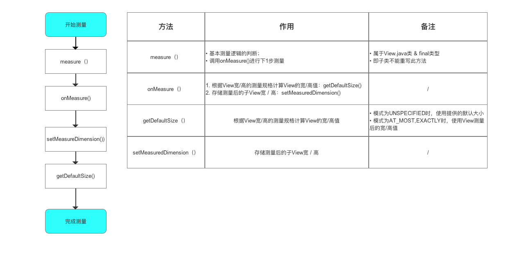

> 实际作用的方法：`getDefaultSize()` = 计算View的宽/高值、`setMeasuredDimension()` = 存储测量后的View宽 / 高

------

# 3.2 ViewGroup的measure过程

- 【应用场景】
  利用现有的组件根据特定的布局方式来组成新的组件
- 【具体使用】
   继承自ViewGroup或各种Layout，含有子 View

> 如：底部导航条中的条目，一般都是上图标(ImageView)、下文字(TextView)，那么这两个就可以用自定义ViewGroup组合成为一个Veiw，提供两个属性分别用来设置文字和图片，使用起来会更加方便。
>
> 

- 【原理】

  1. 遍历测量所有子View的尺寸
  2. 合并将所有子View的尺寸进行，最终得到ViewGroup父视图的测量值

  > 自上而下、一层层地传递下去，直到完成整个View树的`measure()`过程

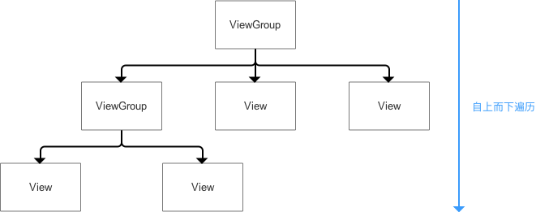

- 【流程】

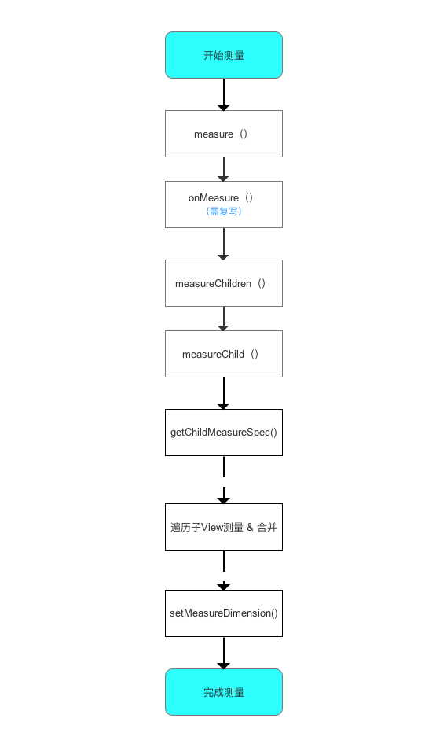

下面我将一个个方法进行详细分析：入口 = `measure()`

> 若需进行自定义ViewGroup，则需重写`onMeasure()`，下文会提到

```dart
/**
  * 源码分析：measure()
  * 作用：基本测量逻辑的判断；调用onMeasure()
  * 注：与单一View measure过程中讲的measure()一致
  **/ 
  public final void measure(int widthMeasureSpec, int heightMeasureSpec) {
    ...
    int cacheIndex = (mPrivateFlags & PFLAG_FORCE_LAYOUT) == PFLAG_FORCE_LAYOUT ? -1 :
            mMeasureCache.indexOfKey(key);
    if (cacheIndex < 0 || sIgnoreMeasureCache) {

        // 调用onMeasure()计算视图大小
        onMeasure(widthMeasureSpec, heightMeasureSpec);
        mPrivateFlags3 &= ~PFLAG3_MEASURE_NEEDED_BEFORE_LAYOUT;
    } else {
        ...
}

/**
  * 分析1：onMeasure()
  * 作用：遍历子View & 测量
  * 注：ViewGroup = 一个抽象类 = 无重写View的onMeasure（），需自身复写
  **/ 
```

**为什么ViewGroup的measure过程不像单一View的measure过程那样对`onMeasure（）`做统一的实现？**（如下代码）

```dart
/**
  * 分析：子View的onMeasure()
  * 作用：a. 根据View宽/高的测量规格计算View的宽/高值：getDefaultSize()
  *      b. 存储测量后的View宽 / 高：setMeasuredDimension()
  * 注：与单一View measure过程中讲的onMeasure()一致
  **/ 
  protected void onMeasure(int widthMeasureSpec, int heightMeasureSpec) {  
    // 参数说明：View的宽 / 高测量规格

    setMeasuredDimension(getDefaultSize(getSuggestedMinimumWidth(), widthMeasureSpec),  
                         getDefaultSize(getSuggestedMinimumHeight(), heightMeasureSpec));  
    // setMeasuredDimension() ：获得View宽/高的测量值 
    // 传入的参数通过getDefaultSize()获得
}
```

- 答：因为不同的ViewGroup子类（LinearLayout、RelativeLayout / 自定义ViewGroup子类等）具备不同的布局特性，这导致他们子View的测量方法各有不同

> 而`onMeasure（）`的作用 = 测量View的宽/高值

**因此，ViewGroup无法对onMeasure（）作统一实现。这个也是单一View的measure过程与ViewGroup过程最大的不同。**

> 1. 即：单一View measure过程的`onMeasure()`具有统一实现，而ViewGroup则没有
> 2. 注：其实，在单一View measure过程中，`getDefaultSize()`只是简单的测量了宽高值，在实际使用时有时需更精细的测量。所以有时候也需重写`onMeasure()`

在自定义ViewGroup中，关键在于：**根据需求复写`onMeasure()`从而实现你的子View测量逻辑**。复写`onMeasure()`的套路如下：

```dart
/**
  * 根据自身的测量逻辑复写onMeasure（），分为3步
  * 1. 遍历所有子View & 测量：measureChildren（）
  * 2. 合并所有子View的尺寸大小,最终得到ViewGroup父视图的测量值（自身实现）
  * 3. 存储测量后View宽/高的值：调用setMeasuredDimension()  
  **/ 

  @Override
  protected void onMeasure(int widthMeasureSpec, int heightMeasureSpec) {  

        // 定义存放测量后的View宽/高的变量
        int widthMeasure ;
        int heightMeasure ;

        // 1. 遍历所有子View & 测量(measureChildren（）)
        // ->> 分析1
        measureChildren(widthMeasureSpec, heightMeasureSpec)；

        // 2. 合并所有子View的尺寸大小，最终得到ViewGroup父视图的测量值
         void measureCarson{
             ... // 自身实现
         }

        // 3. 存储测量后View宽/高的值：调用setMeasuredDimension()  
        // 类似单一View的过程，此处不作过多描述
        setMeasuredDimension(widthMeasure,  heightMeasure);  
  }
  // 从上可看出：
  // 复写onMeasure（）有三步，其中2步直接调用系统方法
  // 需自身实现的功能实际仅为步骤2：合并所有子View的尺寸大小

/**
  * 分析1：measureChildren()
  * 作用：遍历子View & 调用measureChild()进行下一步测量
  **/ 

    protected void measureChildren(int widthMeasureSpec, int heightMeasureSpec) {
        // 参数说明：父视图的测量规格（MeasureSpec）

                final int size = mChildrenCount;
                final View[] children = mChildren;

                // 遍历所有子view
                for (int i = 0; i < size; ++i) {
                    final View child = children[i];
                     // 调用measureChild()进行下一步的测量 ->>分析1
                    if ((child.mViewFlags & VISIBILITY_MASK) != GONE) {
                        measureChild(child, widthMeasureSpec, heightMeasureSpec);
                    }
                }
            }

/**
  * 分析2：measureChild()
  * 作用：a. 计算单个子View的MeasureSpec
  *      b. 测量每个子View最后的宽 / 高：调用子View的measure()
  **/ 
  protected void measureChild(View child, int parentWidthMeasureSpec,
            int parentHeightMeasureSpec) {

        // 1. 获取子视图的布局参数
        final LayoutParams lp = child.getLayoutParams();

        // 2. 根据父视图的MeasureSpec & 布局参数LayoutParams，计算单个子View的MeasureSpec
        // getChildMeasureSpec() 请看上面第2节储备知识处
        final int childWidthMeasureSpec = getChildMeasureSpec(parentWidthMeasureSpec,// 获取 ChildView 的 widthMeasureSpec
                mPaddingLeft + mPaddingRight, lp.width);
        final int childHeightMeasureSpec = getChildMeasureSpec(parentHeightMeasureSpec,// 获取 ChildView 的 heightMeasureSpec
                mPaddingTop + mPaddingBottom, lp.height);

        // 3. 将计算好的子View的MeasureSpec值传入measure()，进行最后的测量
        // 下面的流程即类似单一View的过程，此处不作过多描述
        child.measure(childWidthMeasureSpec, childHeightMeasureSpec);
    }
    // 回到调用原处
```

至此，ViewGroup的measure过程分析完毕

------

- 总结
   `ViewGroup`的`measure`过程如下：

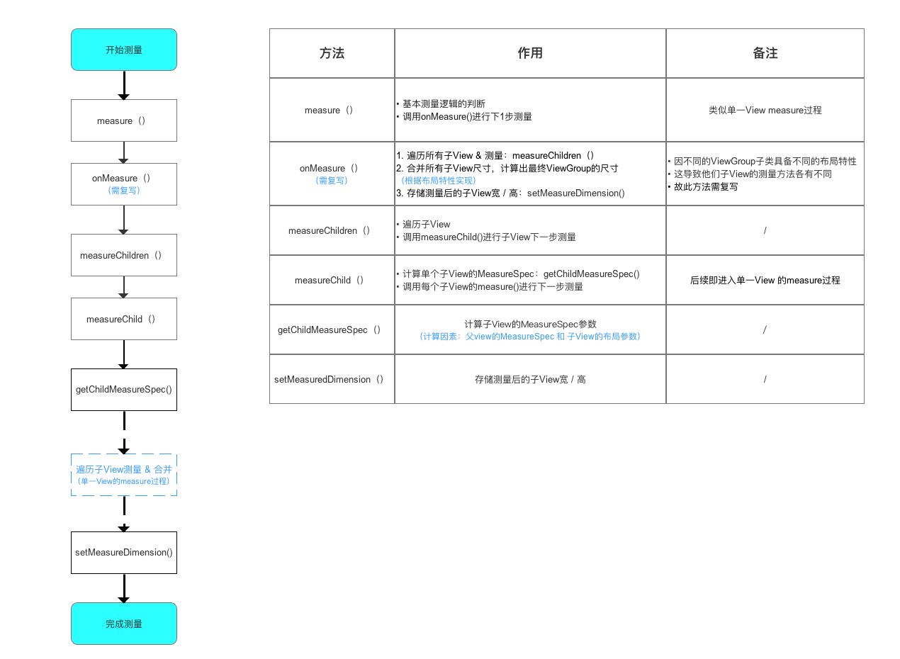

- 为了让大家更好地理解ViewGroup的measure过程（特别是复写`onMeasure()`），下面，我将用ViewGroup的子类LinearLayout来分析下ViewGroup的measure过程

------

# 3.3 ViewGroup的measure过程实例解析（LinearLayout）

此处直接进入`LinearLayout`复写的`onMeasure（）`代码分析：

> 详细分析请看代码注释

```dart
  protected void onMeasure(int widthMeasureSpec, int heightMeasureSpec) {

      // 根据不同的布局属性进行不同的计算
      // 此处只选垂直方向的测量过程，即measureVertical()->>分析1
      if (mOrientation == VERTICAL) {
          measureVertical(widthMeasureSpec, heightMeasureSpec);
      } else {
          measureHorizontal(widthMeasureSpec, heightMeasureSpec);
      }

      
}

  /**
    * 分析1：measureVertical()
    * 作用：测量LinearLayout垂直方向的测量尺寸
    **/ 
  void measureVertical(int widthMeasureSpec, int heightMeasureSpec) {
      
      /**
       *  其余测量逻辑
       **/
          // 获取垂直方向上的子View个数
          final int count = getVirtualChildCount();

          // 遍历子View获取其高度，并记录下子View中最高的高度数值
          for (int i = 0; i < count; ++i) {
              final View child = getVirtualChildAt(i);

              // 子View不可见，直接跳过该View的measure过程，getChildrenSkipCount()返回值恒为0
              // 注：若view的可见属性设置为VIEW.INVISIBLE，还是会计算该view大小
              if (child.getVisibility() == View.GONE) {
                 i += getChildrenSkipCount(child, i);
                 continue;
              }

              // 记录子View是否有weight属性设置，用于后面判断是否需要二次measure
              totalWeight += lp.weight;

              if (heightMode == MeasureSpec.EXACTLY && lp.height == 0 && lp.weight > 0) {
                  // 如果LinearLayout的specMode为EXACTLY且子View设置了weight属性，在这里会跳过子View的measure过程
                  // 同时标记skippedMeasure属性为true，后面会根据该属性决定是否进行第二次measure
                // 若LinearLayout的子View设置了weight，会进行两次measure计算，比较耗时
                  // 这就是为什么LinearLayout的子View需要使用weight属性时候，最好替换成RelativeLayout布局
                
                  final int totalLength = mTotalLength;
                  mTotalLength = Math.max(totalLength, totalLength + lp.topMargin + lp.bottomMargin);
                  skippedMeasure = true;
              } else {
                  int oldHeight = Integer.MIN_VALUE;
     /**
       *  步骤1：遍历所有子View & 测量：measureChildren（）
       *  注：该方法内部，最终会调用measureChildren（），从而 遍历所有子View & 测量
       **/
            measureChildBeforeLayout(

                   child, i, widthMeasureSpec, 0, heightMeasureSpec,
                   totalWeight == 0 ? mTotalLength : 0);
                   ...
            }

      /**
       *  步骤2：合并所有子View的尺寸大小,最终得到ViewGroup父视图的测量值（自身实现）
       **/        
              final int childHeight = child.getMeasuredHeight();

              // 1. mTotalLength用于存储LinearLayout在竖直方向的高度
              final int totalLength = mTotalLength;

              // 2. 每测量一个子View的高度， mTotalLength就会增加
              mTotalLength = Math.max(totalLength, totalLength + childHeight + lp.topMargin +
                     lp.bottomMargin + getNextLocationOffset(child));
      
              // 3. 记录LinearLayout占用的总高度
              // 即除了子View的高度，还有本身的padding属性值
              mTotalLength += mPaddingTop + mPaddingBottom;
              int heightSize = mTotalLength;

      /**
       *  步骤3：存储测量后View宽/高的值：调用setMeasuredDimension()  
       **/ 
       setMeasureDimension(resolveSizeAndState(maxWidth,width))

    ...

  }
```

至此，自定义View的中最重要、最复杂的measure过程讲解完毕。

------

# 4. 总结

- 本文对自定义View中最重要、最复杂的`measure`过程进行了详细分析，具体如下图：

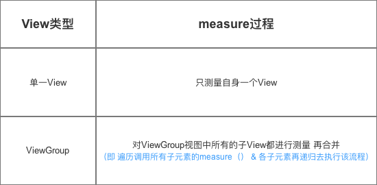


> 作者：Carson_Ho
> 链接：https://www.jianshu.com/p/1dab927b2f36
> 来源：简书
> 著作权归作者所有。商业转载请联系作者获得授权，非商业转载请注明出处。