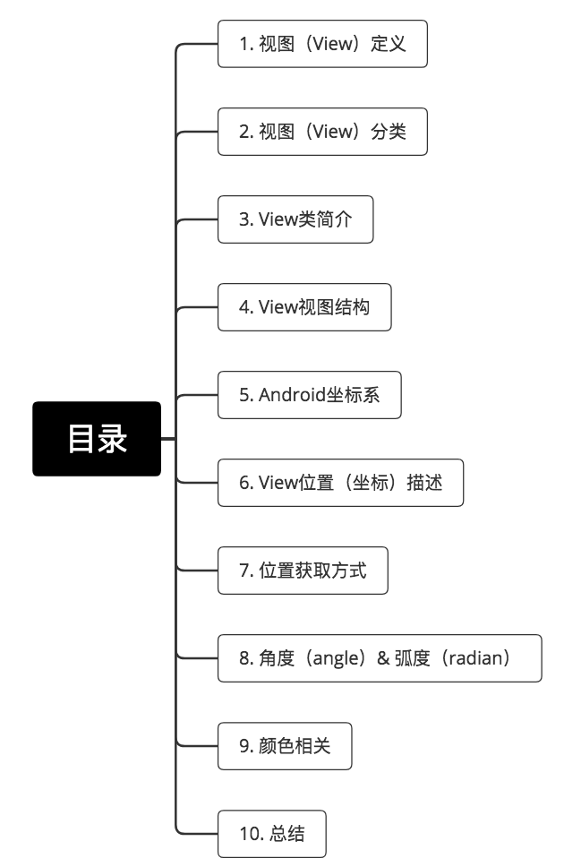
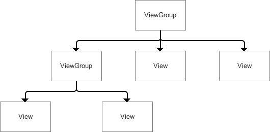
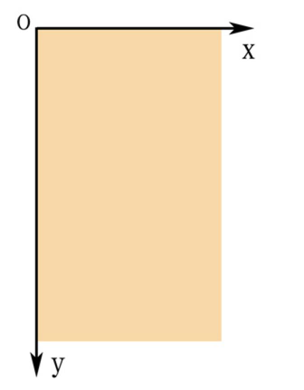
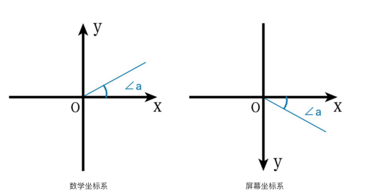
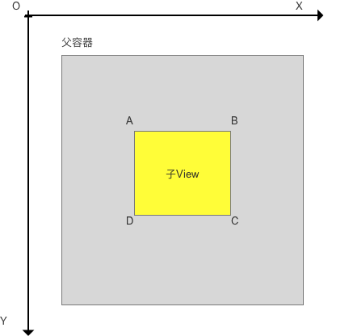
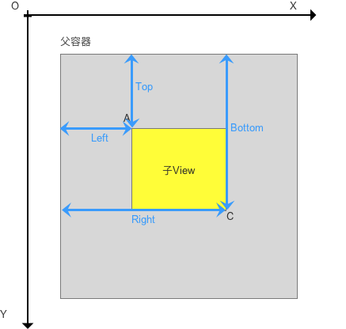
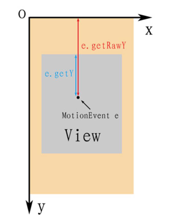
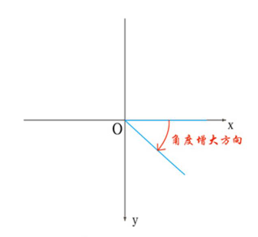
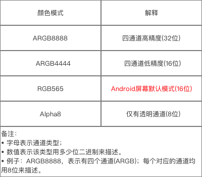
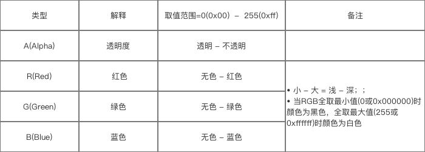

# 前言

- **自定义View原理**是Android开发者必须了解的基础；
- 在了解自定义View之前，你需要有一定的知识储备；
- 本文将全面解析关于自定义View中的所有知识基础。

------

# 目录



------

# 1. 视图（View）定义

视图（View）表现为显示在屏幕上的各种视图，如TextView、LinearLayout等。

------

# 2. 视图（View）分类

- 视图View主要分为两类：

| 类别     |                   解释                    |         特点 |
| -------- | :---------------------------------------: | -----------: |
| 单一视图 |          即一个View，如TextView           | 不包含子View |
| 视图组   | 即多个View组成的ViewGroup，如LinearLayout |   包含子View |

- Android中的UI组件都由View、ViewGroup组成。

------

# 3. View类简介

- View类是Android中各种组件的基类，如View是ViewGroup基类
- View的构造函数：共有4个，具体如下：

> 自定义View必须重写至少一个构造函数：

```java
// 如果View是在Java代码里面new的，则调用第一个构造函数
 	public CarsonView(Context context) {
        super(context);
    }

// 如果View是在.xml里声明的，则调用第二个构造函数
// 自定义属性是从AttributeSet参数传进来的
    public  CarsonView(Context context, AttributeSet attrs) {
        super(context, attrs);
    }

// 不会自动调用
// 一般是在第二个构造函数里主动调用
// 如View有style属性时
    public  CarsonView(Context context, AttributeSet attrs, int defStyleAttr) {
        super(context, attrs, defStyleAttr);
    }

    //API21之后才使用
    // 不会自动调用
    // 一般是在第二个构造函数里主动调用
    // 如View有style属性时
    public  CarsonView(Context context, AttributeSet attrs, int defStyleAttr, int defStyleRes) {
        super(context, attrs, defStyleAttr, defStyleRes);
    }
```

更加具体的使用请看：[深入理解View的构造函数](https://links.jianshu.com/go?to=http%3A%2F%2Fwww.jcodecraeer.com%2Fa%2Fanzhuokaifa%2Fandroidkaifa%2F2016%2F0806%2F4575.html)和[理解View的构造函数](https://links.jianshu.com/go?to=http%3A%2F%2Fwww.cnblogs.com%2Fangeldevil%2Fp%2F3479431.html%23three)。

------

# 4. View视图结构

- 对于多View的视图，**结构是树形结构**：最顶层是ViewGroup
- ViewGroup下可能有多个ViewGroup或View，如下图：



一定要记住：无论是measure过程、layout过程还是draw过程，**永远都是从View树的根节点开始测量或计算（即从树的顶端开始），一层一层、一个分支一个分支地进行（即树形递归），**最终计算整个View树中各个View，最终确定整个View树的相关属性。

------

# 5. Android坐标系

Android的坐标系定义为：

- 屏幕的左上角为坐标原点
- 向右为x轴增大方向
- 向下为y轴增大方向

具体如下图：



**注：区别于一般的数学坐标系**



------

# 6. View位置（坐标）描述

- View的位置由4个顶点决定的（如下A、B、C、D）



4个顶点的位置描述分别由4个值决定：

- Top：子View上边界到父view上边界的距离
- Left：子View左边界到父view左边界的距离
- Bottom：子View下边距到父View上边界的距离
- Right：子View右边界到父view左边界的距离

（请记住：**View的位置是相对于父控件而言的**）

如下图：



**个人建议**：按顶点位置来记忆：

- Top：子View左上角距父View顶部的距离；
- Left：子View左上角距父View左侧的距离；
- Bottom：子View右下角距父View顶部的距离
- Right：子View右下角距父View左侧的距离

------

# 7. 位置获取方式

- View的位置是通过`view.getxxx()`函数进行获取：**（以Top为例）**

```java
// 获取Top位置
public final int getTop() {  
    return mTop;  
}  
// 其余如下：
  getLeft();      //获取子View左上角距父View左侧的距离
  getBottom();    //获取子View右下角距父View顶部的距离
  getRight();     //获取子View右下角距父View左侧的距离
```

- 与MotionEvent中 `get()`和`getRaw()`的区别

```csharp
//get() ：触摸点相对于其所在组件坐标系的坐标
 event.getX();       
 event.getY();
//getRaw() ：触摸点相对于屏幕默认坐标系的坐标
 event.getRawX();    
 event.getRawY();
```

具体如下图：



------

# 8. 角度（angle）& 弧度（radian）

- 自定义View实际上是将一些简单的形状通过计算，从而组合到一起形成的效果。

> 这会涉及到画布的相关操作(旋转)、正余弦函数计算等，即会涉及到角度(angle)与弧度(radian)的相关知识。

- 角度和弧度都是描述角的一种度量单位，区别如下图：：


在默认的屏幕坐标系中角度增大方向为顺时针。



**注：在常见的数学坐标系中角度增大方向为逆时针**

------

# 9. 颜色相关

Android中的颜色相关内容包括颜色模式，创建颜色的方式，以及颜色的混合模式等。

### 9.1 颜色模式

Android支持的颜色模式：



以ARGB8888为例介绍颜色定义:



### 9.2 定义颜色的方式

#### 9.2.1 在java中定义颜色

```cpp
 //java中使用Color类定义颜色
 int color = Color.GRAY;     //灰色
  //Color类是使用ARGB值进行表示
  int color = Color.argb(127, 255, 0, 0);   //半透明红色
  int color = 0xaaff0000;                   //带有透明度的红色
```

#### 9.2.2 在xml文件中定义颜色

在/res/values/color.xml 文件中如下定义：

```xml
<?xml version="1.0" encoding="utf-8"?>
<resources>
    //定义了红色（没有alpha（透明）通道）
    <color name="red">#ff0000</color>
    //定义了蓝色（没有alpha（透明）通道）
    <color name="green">#00ff00</color>
</resources>
```

在xml文件中以”#“开头定义颜色，后面跟十六进制的值，有如下几种定义方式：

```bash
  #f00            //低精度 - 不带透明通道红色
  #af00           //低精度 - 带透明通道红色
  #ff0000         //高精度 - 不带透明通道红色
  #aaff0000       //高精度 - 带透明通道红色
```

### 9.3 引用颜色的方式

9.3.1 在java文件中引用xml中定义的颜色：

```cpp
//方法1
int color = getResources().getColor(R.color.mycolor);
//方法2（API 23及以上）
int color = getColor(R.color.myColor);    
```

#### 9.3.2 在xml文件(layout或style)中引用或者创建颜色

```xml
 <!--在style文件中引用-->
    <style name="AppTheme" parent="Theme.AppCompat.Light.DarkActionBar">
        <item name="colorPrimary">@color/red</item>
    </style>
 <!--在layout文件中引用在/res/values/color.xml中定义的颜色-->
  android:background="@color/red"     
 <!--在layout文件中创建并使用颜色-->
  android:background="#ff0000"        
```

> 作者：Carson_Ho
> 链接：https://www.jianshu.com/p/146e5cec4863
> 来源：简书
> 著作权归作者所有。商业转载请联系作者获得授权，非商业转载请注明出处。